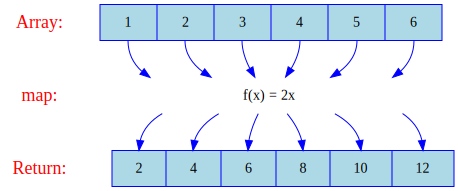
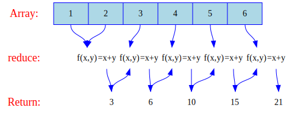

# EcmaScript

<!-- 
  TODO
  Tipos
  Precedence Table, Reserved Token, Comment 
  https://resources.jointjs.com/demos/javascript-ast
  https://astexplorer.net
  http://esprima.org/demo/parse.html
-->

* [Referências](#referências)
* [Variable](#variable)
  * Declarations: [var](#var), [let](#let), [const](#const)
  * [Multiple Declaration](#multiple-declaration)
  * [Dynamic Type](#dynamic-type)
  * [Case Sensitive](#case-sensitive)
  * [Identifier Pattern](#identifier-pattern)
  * [Hoisting](#hoisting)
* [Expression and Operator](#expression-and-operator)
  * [Primary expressions](#primary-expressions-this-function-class-function-yield-yield---abci--): `this`, `function`, `class`, `function*`, `yield`, `yield*`, `[]`, `{}`, `/ab+c/i`, `( )`
  * [Left-hand-side expressions](#left-hand-side-expressions-objectproperty-new-newtarget-super-obj): `object.property`, `new`, `new.target`, `super`, `...obj`
  * [Increment and decrement](#increment-and-decrement-a-a-a-a): `A++`, `A--`, `++A`, `--A`
  * [Unary operators](#unary-operators-delete-void-typeof-----): `delete`, `void`, `typeof`, `+`, `-`, `~`, `!`
  * [Arithmetic operators](#arithmetic-operators-------): `+`, `-`, `*`, `/`, `%`, `**`
  * [Relational operators](#relational-operators-in-instanceof----): `in`, `instanceof`, `<`, `<=`, `>`, `>=`
  * [Equality operators](#equality-operators----): `==`, `!=`, `===`, `!==`
  * [Bitwise shift operators](#bitwise-shift-operators-): `<<`, `>>`, `>>>`
  * [Binary bitwise operators](#binary-bitwise-operators---): `&`, `|`, `^`
  * [Binary logical operators](#binary-logical-operators--): `&&`, `||`
  * [Conditional operator](#conditional-ternary-operator-condition--iftrue--iffalse): `? :`
  * [Assignment operators](#assignment-operators-----------): `=`, `*=`, `/=`, `%=`, `+=`, `-=`, `<<=`, `>>=`, `>>>=`, `&=`, `^=`, `|=`
  * [Destructuring Assignment](#destructuring-assignment)
  * [Comma operator](#comma-operator-): `,`
* [Statements and Declarations](#statements-and-declarations)
  * [Control flow](#): `block`, `break`, `continue`, `empty`, `if...esle`, `switch`, `throw`, `try...catch`)
  * [Iterations](#): `do...while`, `for`, `for...in`, `for...of`, `while`, `do...while`
  * Others: `debugger`, `export`, `import`, `label`(#)
  * Declarations: `var`, `let`, `const`
  * Functions and classes: `function`, `function*`, `return`, `class`
* [Function](#function)
  * [Defining Functions / Function Statement](#defining-functions--function-statement)
  * [Recursion](#recursion)
  * [Scope](#scope)
  * [Hoisting](#hoisting-1)
  * [Case Sensitive](#case-sensitive-1)
  * [Overload](#overload)
  * [Default Parameters](#default-parameters)
  * [Destructuring Assignment](#destructuring-assignment)
  * [Named Parameters / Keyword Parameters](#named-parameters--keyword-parameters)
  * [Arguments Object / es5](#arguments-object--es5)
  * [Rest parameters (spread operator) ES6](#rest-parameters-spread-operator-es6)
  * [Function Expression / Anonymous Function](#function-expression--anonymous-function)
  * [Immediately Invokable Function Expressions (IIFE)](#immediately-invokable-function-expressions-iife)
  * [Method / Callback](#method--callback)
  * [Closure](#closure)
  * [Nested functions and closures](#nested-functions-and-closures)
  * [ES6 Arrow Function `=>`](#es6-arrow-function-)
  * [Higher-Order Function](#higher-order-function)
* Types:
  * Primitive
    * [Boolean](#boolean)
    * [Null](#null)
    * [Undefined](#undefined)
    * [Number](#number)
    * [String](#string)
      * [String Literal](#string-literal)
      * [String Multiline](#string-multiline)
      * [Special Cases](#special-cases)
      * [Special Characters / Escape Sequences](#special-characters--escape-sequences)
      * [Template String (Ecma6)](#template-string-ecma6)
      * [Array of characters](#array-of-characters)
      * [Unicode and JavaScript](#unicode-and-javascript)
      * [Surrogate Pair <h,l>](#surrogate-pair-hl)
      * [Unicode problem](#unicode-problem)
    * [Symbol](type/Symbol.js)
  * Object
    * Global Objects
      * [Boolean Object](#boolean-object.js)
      * [Array Object](#array)
        * [Create an Array [ ]](#create-an-array--)
        * [Changing Array](#changing-array)
        * [Defining Empty Array](#defining-empty-array)
        * [Accessing Array Elements](#accessing-array-elements)
        * [Multiple Types](#multiple-types)
        * [String Index](#string-index)
        * [Nth Dimentions](#nth-dimentions)
        * [Spread Operator](#spread-operator)
        * [Interaction: `for`, `for...of`, `for...in`)](#interaction-for-forof-forin-forkey-value-of-entries)
        * [Array Object](#array-object)
          * [Array Methods](#array-methods): [`from()`](#arrayfrom)
          * [Array Instances](#array-instances):
            * Property: [`length`](#arrayprototypelength)
            * Mutator: [`push()`](#arrayprototypepush), [`unshift()`](#arrayprototypeunshift), [`pop()`](#arrayprototypepop), [`shift()`](#arrayprototypeshift), [`reverse()`](#arrayprototypereverse), [`sort()`](#arrayprototypesort), [`splice()`](#arrayprototypesplice)
            * Accessor: [`includes()`](#arrayprototypeincludes), [`join()`](#arrayprototypejoin), [`slice()`](#arrayprototypeslice), [`concat()`](#arrayprototypeconcat)
            * Iteration: [`entries()`](#arrayprototypeentries), [`forEach()`](#arrayprototypeforeach), [`map()`](#arrayprototypemap), [`reduce()`](#arrayprototypereduce), [`reduceRight()`](#arrayprototypereduceright), [`filter()`](#arrayprototypefilter), [`find()`](#arrayprototypefind), [`every()`](#arrayprototypeevery), [`some()`](#arrayprototypesome)
      * Object
        * [Object Properties](#object-properties)
          * [Post Data](#post-data): JSON, Object, Constructor function, class
        * [Object Methods](#object-methods)
          * [Person Data](#person-data): JSON, Object, Constructor function, class
        * [Prototype](#prototype)
        * [Changing Object](#changing-object)
        * [Interaction](#interaction)
        * [Array of Objects](#array-of-objects)
        * [Reference vs Value](#reference--value)
        * [Defining classes](#defining-classes)
          * [Prototype methods](#prototpy-methodos)
          * [Static methods](#static-methods)
          * [Getters & Setters](#getters-and-setters)
    * Numbers and dates
      * [Number Object](#number-object)
      * [Math](#math)
      * [Date](#date)
    * Text processing
      * [String Object](#string-object)
        * [String Syntax](#string-syntax)
        * [String Method](#string-methods): [`fromCharCode()`](#string.fromCharCode), [`fromCharPoint()`](#string.fromCharPoint)
        * [String Instance](#string-instances): [`includes()`](#stringprototypeincludes), [`repeat()`](#stringprototyperepeat), [`starstWith()`](#stringprototypestarstwith), [`endsWith()`](#stringprototypeendswith), [`substr()`](#stringprototypesubstr), [`substring()`](#stringprototypesubstring), [`slice()`](#stringprototypeslice), [`split()`](#stringprototypesplit), [`toLowerCase()`](#stringprototypetolowercase), [`toUpperCase()`](#stringprototypetouppercase), [`match()`](#stringprototypematch), [`replace()`](#stringprototypereplace), [`search()`](#stringprototypesearch), [`trim()`](#stringprototypetrim)
      * RegExp
        <!-- [OO](type/RegExp-OO.js), [Patterns](type/RegExp-patterns.js) e [Syntax](type/RegExp-syntax.js) -->
    * Indexed collections
      * [Typed Array](#array-typed)
    * Keyed collections
      * [Keyed](#keyed-collections)
    * Structured data
      * [JSON](#javascript-object-notation-json): [Object](#json), [data](#json)
    * Internationalization
      * [Intl](#intl)
* [Modules](#modules)
* [Async & Await](#async--await)
* [Promise](#promise)
* [Generator](#generator)
* [Handling Error](#handling-error)
  * [Throwing a generic error (`throw`)](#throwing-a-generic-error-throw)
  * [Handling a specific error (`try...catch`, `try...finally`, `try...catch...finally`)](#handling-a-specific-error-trycatch-tryfinally-trycatchfinally)
  * [Custom Error Types](#custom-error-types)
  * [Handling a specific error](#handling-a-specific-error)

## Referências

* Portais sobre JS: [MDN](https://developer.mozilla.org/en-US/docs/Web/JavaScript) e [WP](https://docs.webplatform.org/wiki/javascript)
* Guias de JS: [MDN](https://developer.mozilla.org/en-US/docs/Web/JavaScript/Guide) e [WP](https://docs.webplatform.org/wiki/javascript)
* Referências de JS: [W3C](http://www.ecma-international.org/publications/standards/Ecma-262.htm),  [MDN](https://developer.mozilla.org/en-US/docs/Web/JavaScript/Reference#Value_properties) e [WP](https://docs.webplatform.org/wiki/javascript)
* [Literais](https://developer.mozilla.org/en-US/docs/Web/JavaScript/Reference/Lexical_grammar#Literals) do JS
* [Tabela de Precedência](https://developer.mozilla.org/en-US/docs/Web/JavaScript/Reference/Operators/Operator_Precedence)
* Features: ES6 ([es6-features.org](http://es6-features.org/), [MDN](https://developer.mozilla.org/en/docs/Web/JavaScript/New_in_JavaScript/ECMAScript_6_support_in_Mozilla), [kangax](http://kangax.github.io/compat-table/es6/) e [git.io/es6features](https://github.com/lukehoban/es6features))

## Variable

* * *

[Reference](https://developer.mozilla.org/en-US/docs/Web/JavaScript/Reference#Declarations)

### var
```js
var number;
var number      // Automatic semicolon insertion (ASI)
var number = 10 // int number = 10; (C language)
```

### let
```js
let number = 10
console.log(number) //=> 10
```

### const
```js
const NUMBER = 10
NUMBER = 100        // TypeError
console.log(NUMBER) //=> 10
```

### Multiple Declaration
```js
var x, y, z
console.log(x) //=> undefined
console.log(y) //=> undefined
console.log(z) //=> undefined
```

```js
var a = 1, b = 2, c = 3
console.log(a); //=> 1
console.log(b); //=> 2
console.log(c); //=> 3
```

### Dynamic Type
```js
let number = 10
console.log(number)        //=> 10
console.log(typeof number) //=> number

number = 'fulano'
console.log(typeof number) //=> string
console.log(number)        //=> 'fulano'
```

### Case Sensitive
```js
let number = 8
let NUmber = 80
```

### Identifier Pattern

[Reference](https://developer.mozilla.org/en-US/docs/Web/JavaScript/Guide/Grammar_and_Types#Variables)

```js
let 0number  //SyntaxError (^\W)
let %number  //SyntaxError (^\W)
let var      //SyntaxError (keyword)
let function //SyntaxError (keyword)
let number
let _number
let $number
```

### Hoisting

[Reference](https://developer.mozilla.org/en-US/docs/Web/JavaScript/Guide/Grammar_and_Types#Variable_hoisting)

```js
nome = 'fulano'
console.log(nome)      //=> 'fulano'
```

```js
console.log(outroNome) // ReferenceError
outroNome = 10
```

```js
console.log(outroNome) // undefined
let outroNome = 10
```

<!-- TODO
https://github.com/getify/You-Dont-Know-JS/blob/master/up%20%26%20going/ch1.md
Values & Types 
Converting Between Types (coercion, implicitly coerce) https://github.com/getify/You-Dont-Know-JS/blob/master/types%20%26%20grammar/ch4.md
-->

## Expression and Operator

* * *

Reference: [MDN](https://developer.mozilla.org/en-US/docs/Web/JavaScript/Reference/Operators)

### Primary expressions (this, function, class, function*, yield, yield*, [], {}, /ab+c/i, ( ))

### Left-hand-side expressions (object.property, new, new.target, super, ...obj)

```js
let obj = {number: 10}
console.log(obj.number)       //=> 10

let numbers = [1, 2, 3]
// spread operator
console.log(...numbers, 4, 5) //=> [1, 2, 3, 4, 5]
```

### Increment and decrement (A++, A--, ++A, --A)

```js
let number = 10

console.log(number++)      //=> 10
console.log(++number)      //=> 12
console.log(number--)      //=> 12
console.log(--number)      //=> 10
```

### Unary operators (delete, void, typeof, +, -, ~, !)

```js
let numbers = [1, 2, 3]
console.log(numbers)        //=> [ 1, 2, 3 ]

delete numbers[1]
console.log(numbers)        //=> [ 1, , 3 ]

console.log(typeof numbers) //=> object

let number = 15
console.log(number)  //=>  15
console.log(-number) //=> -15
console.log(+number) //=>  15 01111111111111111111111111111111

// Bitwise NOT
console.log(~number) //=> -16 10000000000000000000000000000000

// Logical NOT
console.log(!number) //=> false
```

### Arithmetic operators (+, -, *, /, %, **)

```js
console.log(10 + 3)             //=> 13
console.log(true + 3)           //=> 4
console.log(10 - 3)             //=> 7
console.log(1.4 - 1.2)          //=> 0.19999999999999996 (IEEE 754)
console.log(10 * 3)             //=> 30
console.log(10 / 3)             //=> 3.3333333333333335
console.log(parseInt(10 / 3))   //=> 3
console.log(Math.trunc(10 / 3)) //=> 3 - Integer division
console.log(10 % 3)             //=> 1
console.log(10 ** 3)            //=> 1000
console.log(Math.pow(10, 3))    //=> 1000
```

### Relational operators (in, instanceof, <, <=, >, >=)

```js
let numbers = [1, 2, 3]

console.log(0 in numbers)                   //=> true
console.log(1 in numbers)                   //=> true
console.log(3 in numbers)                   //=> false
console.log("value" in {value: 1})          //=> true
console.log("PI" in Math)                   //=> true
console.log("" instanceof String)           //=> false
console.log(new String() instanceof String) //=> true
console.log(1 < 10)                         //=> true
console.log(1 <= 10)                        //=> true
console.log(10 > 1)                         //=> true
console.log(10 >= 1)                        //=> true
```

### Equality operators (==, !=, ===, !==)

Reference: [Comparison Operators](https://developer.mozilla.org/en-US/docs/Web/JavaScript/Reference/Operators/Comparison_Operators), [Equality Comparisons and Sameness](https://developer.mozilla.org/en-US/docs/Web/JavaScript/Equality_comparisons_and_sameness), [JavaScript Equality Table](http://dorey.github.io/JavaScript-Equality-Table/)

```js
//  false == false, 0, "0", "", [], [0]

//  Equality: type–converting comparisons
console.log(1 == 1)                 //=> true
console.log(1 == "1")               //=> true
console.log(1 == "1a")              //=> false
console.log(1 == true)              //=> true
console.log(0 == false)             //=> false
console.log(false == "")            //=> true
console.log(false == [])            //=> true
console.log(false == null)          //=> false
console.log(false == undefined)     //=> false
console.log({"value":1} == {"value":1}) //=> false
let obj = {"value":1}
console.log(obj == obj)             //=> true
console.log(undefined == undefined) //=> true
console.log(null == null)           //=> true
console.log(NaN == NaN)             //=> false
console.log(Object.is(NaN, NaN))    //=> true
console.log(Object.is([], []))      //=> false / Not comapre Array
console.log(Object.is({}, {}))      //=> false / Not comapre Object

//  Identity/strict equality: strict and type–converting comparisons
console.log(1 === 1)     //=> true
console.log(1 === "1")   //=> false
console.log("1" === "1") //=> true
```

### Bitwise shift operators (<<, >>, >>>)

```js
//  Bitwise operators treat their operands as a sequence of 32 bits
//  -(2 ** 32)  até 2 ** 31 - 1
//  -2147483648 até 2147483647

console.log( 9 )      //=> 00000000000000000000000000001001   9
console.log( 9 <<  2) //=> 00000000000000000000000000100100  36
console.log( 9 >>  2) //=> 00000000000000000000000000000010   2
console.log( 9 >>> 2) //=> 00000000000000000000000000000010   2
console.log(-9 )      //=> 11111111111111111111111111110110  -9
console.log(-9 >>  2) //=> 11111111111111111111111111111101  -3
console.log(-9 >>> 2) //=> 00111111111111111111111111111101  1073741821
```

#### Encoding Mantis green ARGB - rgba(116, 195, 101, 0)

Reference:
* [RGBA color space](https://en.wikipedia.org/wiki/RGBA_color_space)

```js
const alfa  = 0
const red   = 116
const green = 195
const blue  = 101
const color = (alfa & 0xff) << 24 | (red & 0xff) << 16 | (green & 0xff) << 8 | (blue & 0xff)

// 00000000000000000000000011111111 (0)
// 00000000000000000000000011111111 (0xff)
// 00000000000000000000000000000000 (& 0xff)
// 11111111000000000000000000000000 (<< 24)

// 00000000000000000000000001110100 (116)
// 00000000000000000000000011111111 (0xff)
// 00000000000000000000000001110100 (& 0xff)
// 00000000011101000000000000000000 (<< 16)

// 00000000000000000000000011000011 (195)
// 00000000000000000000000011111111 (0xff)
// 00000000000000000000000011000011 (& 0xff)
// 00000000000000001100001100000000 (<< 8)

// 00000000000000000000000001100101 (101)
// 00000000000000000000000011111111 (0xff)
// 00000000000000000000000001100101 (& 0xff)

// 11111111000000000000000000000000 (alfa)
// 00000000011101000000000000000000 (red)
// 00000000000000001100001100000000 (green)
// 00000000000000000000000001100101 (blue)
// 11111111011101001100001101100101 (|) 
// 0x74C365 (alfa 100%)
```

#### Decoding Mantis green ARGB - #74C365
```js
const color = 0x74C365;
// 11111111011101001100001101100101 (alfa 100%)

const alfa  = (color >>> 24) & 0xff
// 11111111011101001100001101100101 
// 00000000000000000000000011111111 (>>> 24)
// 00000000000000000000000011111111 (0xff)
// 00000000000000000000000000000000 (& 0xff)
// 255

const red   = (color >> 16) & 0xff
// 00000000011101001100001101100101
// 00000000000000000000000001110100 (>> 16)
// 00000000000000000000000011111111 (0xff)
// 00000000000000000000000001110100 (& 0xff)
// 116

const green = (color >>  8) & 0xff
// 00000000011101001100001101100101
// 00000000000000000111010011000011 (>> 8)
// 00000000000000000000000011111111 (0xff)
// 00000000000000000000000011000011 (& 0xff)
// 195

const blue  = color & 0xff
// 00000000011101001100001101100101
// 00000000000000000000000011111111 (0xff)
// 00000000000000000000000001100101 (& 0xff)
// 101
```

### Binary bitwise operators (&, |, ^)

```js
console.log(9     )   //=> 00000000000000000000000000001001   9
console.log(14    )   //=> 00000000000000000000000000001110  14
console.log(14 & 9)   //=> 00000000000000000000000000000100   8
console.log(14 | 9)   //=> 00000000000000000000000000001111  15
console.log(14 ^ 9)   //=> 00000000000000000000000000000101   7
```

### Binary logical operators (&&, ||)

```js
//  false == false, 0, "", null, undefined, NaN

console.log(true  && true )     // t && t returns true
console.log(true  && false)     // t && f returns false
console.log(false && true )     // f && t returns false
console.log(false && (3 == 4))  // f && f returns false
console.log("Cat" && "Dog")     // t && t returns "Dog"
console.log(true  && "Cat")     // f && t returns "Cat"
console.log("Cat" && true )     // t && f returns true
console.log(false && "Cat")     // f && t returns false
console.log("Cat" && false)     // t && f returns false
console.log(1     && 2    )     // t && t returns 2
console.log(true  && 2    )     // f && t returns 2
console.log(1     && true )     // t && f returns true
console.log(false && 2    )     // f && t returns false
console.log(1     && false)     // t && f returns false
console.log(""    && false)     // returns ""
console.log(false && ||   )     // returns false
console.log(true  || true)      // t || t returns true
console.log(false || true)      // f || t returns true
console.log(true  || false)     // t || f returns true
console.log(false || (3 == 4))  // f || f returns false
console.log("Cat" || "Dog")     // t || t returns "Cat"
console.log(false || "Cat")     // f || t returns "Cat"
console.log("Cat" || false)     // t || f returns "Cat"
console.log(""    || false)     // t || f returns false
console.log(false || "")        // f || t returns ""
console.log(false && true  || true)   //=> true
console.log(false && (true  || true)) //=> false

let variable
let temp = variable || 10
console.log(temp) //=> 10

let variable = 1
let temp = variable || 10
console.log(temp) //=> 1
```

### Conditional (ternary) operator (condition ? ifTrue : ifFalse)

```js
console.log(true ? 'true' : 'false') //=> 'true'
```

### Assignment operators (=, *=, /=, %=, +=, -=, <<=, >>=, >>>=, &=, ^=, |=)

### Destructuring Assignment

Reference: [MDN](https://developer.mozilla.org/en-US/docs/Web/JavaScript/Reference/Operators/Destructuring_assignment)

```js
// [a, b] = [1, 2] / Array Matching
let [a, b] = [8, 80]
console.log(a) //=> 8
console.log(b) //=> 80

let [a, , b] = [8, 80, 800] // Ignoring some values
console.log(a) //=> 8
console.log(b) //=> 80

let a = 1 // Swapping variables
let b = 3
[a, b] = [b, a]
console.log(a) //=> 3
console.log(b) //=> 1

let [number, string] = [8, 'fulano']
console.log(number) //=> 8
console.log(string) //=> 'fulano'

let [ip, mask = '255.255.255.0'] = ['192.168.0.2'] // Fail-Soft Destructuring
console.log(ip)     //=> '192.168.0.2'
console.log(mask)   //=> '255.255.255.0'

let [ip, mask = '255.255.255.0'] = ['192.168.0.2', '255.255.0.0']
console.log(ip)     //=> '192.168.0.2'
console.log(mask)   //=> '255.255.0.0'

// {a, b} = {a:1, b:2} / Object Matching
let {ip, mask} = {ip: '192.168.0.2', mask: '255.255.255.0'}
console.log(ip)     //=> '192.168.0.2'
console.log(mask)   //=> '255.255.255.0'
```

#### Deep Matching

```js
let {ip: ipAdd, mask: maskAdd} = {ip: '192.168.0.2', mask: '255.255.255.0'}
console.log(ipAdd)   //=> '192.168.0.2'
console.log(maskAdd) //=> '255.255.255.0'

let {mask: maskAdd, ip: ipAdd} = {ip: '192.168.0.2', mask: '255.255.255.0'}
console.log(ipAdd)   //=> '192.168.0.2'
console.log(maskAdd) //=> '255.255.255.0'

let {mask: maskAdd, ip: ipAdd, ip: ipAdd2} = {ip: '192.168.0.2', mask: '255.255.255.0'}
console.log(ipAdd)   //=> '192.168.0.2'
console.log(ipAdd2)  //=> '192.168.0.2'
console.log(maskAdd) //=> '255.255.255.0'
```

### Comma operator (,)

```js
let x, y
```

## Statements and Declarations

* * *

### Control flow (block, break, continue, empty, if...esle, switch, throw, try...catch)

<!-- 
TODO
# # #
 # #
# #
 #

continue & break 
-->

#### if...else

```js
let number = 10
let result

// does not executes: false, 0, "", null, undefined, NaN
if(number < 0) {
  result = "menor que zero"
} else if (number > 0) {
  result = "maior que zero"
} else {
  result = "igual a zero"
}

console.log(result)
```

#### switch

```js
let number1 = 10
let number2 = 10
let operator = '+' // (+, -, *, /)
let result

switch(operator) { // strict comparison
  case 'add':
  case '+':
    result = number1 + number2
    break
  case '-':
    result = number1 - number2
    break
  case '*':
    result = number1 * number2
    break
  case '/':
    result = number1 / number2
    break
  default:
    result = 0
}

console.log(result)
```

### Iterations (do...while, for, for...in, for...of, while)

#### for

```js
for(let flag = 0; flag < 100; flag++){
    console.log(flag)
}
```

```js
let result = ''

for(let flag = 0; flag < 100; flag++){
    result += (flag < 10)? '0' + flag + ' ' : flag + ' '
    if((flag + 1) % 10 == 0)
      result += '\n'
}

console.log(result)
```

#### for...in: Iterates over the enumerable properties of an object

```js
let numbers = [1, 2, 3, 4]

for(let index in numbers){
  console.log(index)
}

// numbers['number'] = 10
```

```js
let numbers = [1, 2, 3, 4]

// numbers['number'] = 10

for(let index in numbers){
  console.log(`${index} -> ${numbers[index]}`)
}
```

#### for...of: Iterates over iterable objects (including arrays, array-like objects, iterators and generators)

```js
let numbers = [1, 2, 3, 4]
for(let number of numbers){
  console.log(number)
}
```

```js
let numbers = [1, 2, 3, 4]

for(let [index, number] of numbers.entries()){
  console.log(`${index} => ${number}`)
}

// numbers['number'] = 10
```

#### for...of Object.keys

```js
let student = {
  "id": 1,
  "name": "fulano",
  "email": "fulano@gmail.com"
}

for(let index of Object.keys(student)){
  console.log(student[index])
}
```

#### for...of Object.values

```js
let student = {
  "id": 1,
  "name": "fulano",
  "email": "fulano@gmail.com"
}

for(let values of Object.values(student)){
  console.log(values)
}
```

#### for...of Object.entries

```js
let student = {
  "id": 1,
  "name": "fulano",
  "email": "fulano@gmail.com"
}

for(const [key, value] of Object.entries(student)){
  console.log(key)
  console.log(value)
}
```

#### while

```js
let result = ""

while(result.length < 4){
  result += 'x'
  console.log(result)
}
```

#### do...while

```js
let result = ""
do {
  result += 'x'
  console.log(result)
} while(result.length < 4)
```

### Others (debugger, export, import, label)

### Declarations (var, let, const)

### Functions and classes (function, function*, return, class)

## Function

* * *

[Reference](https://developer.mozilla.org/en-US/docs/Web/JavaScript/Reference/Functions), [Guide](https://developer.mozilla.org/en-US/docs/Web/JavaScript/Guide/Functions)

### Defining Functions / Function Statement
```js
function addition(param1, param2){
  return param1 + param2
}

// Calling functions
console.log(addition(1))       //=> NaN
console.log(addition(1, 1))    //=> 2
console.log(addition(1, 1, 3)) //=> 2
```

### Recursion
```js
function factorial(n) {
  return n == 0 ? 1 : n * factorial(n - 1)
}

console.log(factorial(4)) //=> 24
```

### Scope
```js
var x = 'outside'
function f1(){
  var x = 'inside'
}
console.log(x) //=> 'outside'
f1()
console.log(x) //=> 'outside'
```

```js
var x = 'outside'
function f1(){
  let x = 'inside'
}
console.log(x) //=> 'outside'
f1()
console.log(x) //=> 'outside'
```

```js
var x = 'outside'
function f2(){
  x = 'inside'
}
console.log(x) //=> 'outside'
f2()
console.log(x) //=> 'inside'
```

### Hoisting
```js
console.log(addition(1, 1)) //=> 2

function addition(param1, param2){
  return param1 + param2
}
```

### Case Sensitive
```js
function addition(param1, param2){
  return param1 + param2
}

function Addition(param){
  return param + 1
}

console.log(Addition(1))    //=> 2
console.log(Addition(1, 2)) //=> 2
```

### Overload
```js
function addition(param1, param2){
  return param1 + param2
}

function addition(param){
  return param + 1
}

console.log(addition(1))    //=> 2
console.log(addition(1, 2)) //=> 2
```

### Default Parameters
```js
function addition(param1, param2=0){
  return param1 + param2
}

console.log(addition(1, 1)) //=> 2
console.log(addition(1))    //=> 1
```

### Destructuring Assignment
```js
function addition(param1, param2, param3, param4){
  return param1 + param2 + param3 + param4
}

console.log(addition(...[1, 2, 1, 2]))         //=> 6
console.log(addition(...[1, 2], ...[1, 2]))    //=> 6
console.log(addition(...[1, 2], 1, ...[2]))    //=> 6
console.log(addition(...[1, 2], 1, ...[1, 2])) //=> 5
```

### Named Parameters / Keyword Parameters
```js
function addition({a = 0, b = 0}){
  return a + b
}

console.log(addition({a: 1, b: 1})) //=> 2
console.log(addition({b: 1, a: 1})) //=> 2
console.log(addition({b: 1}))       //=> 1
console.log(addition({}))           //=> 0
```

### Arguments Object / es5
```js
function addition(){
  let summation = 0
  for(let value of arguments){
    summation += value
  }
  return summation
}

console.log(addition(1))          //=> 1
console.log(addition(1, 1))       //=> 2
console.log(addition(1, 1, 1, 1)) //=> 4
```

### Rest parameters (spread operator) ES6
```js
function addition(...params){
  let summation = 0
  for(let value of params){
    summation += value
  }
  return summation
}

console.log(addition(1))          //=> 1 ([1])
console.log(addition(1, 1))       //=> 2 ([1, 1])
console.log(addition(1, 1, 1, 1)) //=> 4 ([1, 1, 1, 1])
```

```js
// operator: '+', '*'
function calc(operator, ...params){
  let result = operator == '+' ? 0 : 1
  for(let arg of params){
    result = operator == '+' ? result + arg : result * arg
  }
  return result
}

console.log(calc('+', 1))       //=> 1 ('+', [1])
console.log(calc('+', 1, 1))    //=> 2 ('+', [1, 1])
console.log(calc('*', 1, 1, 1)) //=> 1 ('*', [1, 1, 1])
```

### Function Expression / Anonymous Function
```js
function(param1, param2){
  return param1 + param2
}
```

```js
const addition = function(param1, param2){
  return param1 + param2
}

console.log(addition)       //=> [Function: sum]
console.log(addition(1, 2)) //=> 3
```

```js
const addition = function sum(param1, param2){
  return param1 + param2
}
console.log(addition)       //=> [Function: sum]
console.log(addition(1, 2)) //=> 3
console.log(sum(1, 2))      //  ReferenceError: sum is not defined
```

### Immediately Invokable Function Expressions (IIFE)
```js
(function(param1, param2){
  console.log(param1 + param2)
})(1, 2) //=> 3
```

### Method / Callback
```js
let ip = {
  address: '192.168.0.1',
  mask: '255.255.255.0',
  toString: function(){
    return `${this.address}/${this.mask}`
  }
}

console.log(ip.address)    //=> '192.168.0.1'
console.log(ip.toString()) //=> '192.168.0.1/255.255.255.0'
```

### Closure
```js
function multiplier(factor){
  return function(number){
    return number * factor
  }
}

let twice = multiplier(2)
console.log(twice(5)) //=> 10
```

### Nested functions and closures
```js
function addSquares(a,b) {
  function square(x) {
    return x * x
  }
  return square(a) + square(b)
}

console.log(squares(2,3))    // ReferenceError
console.log(addSquares(2,3)) //=> 13
console.log(addSquares(3,4)) //=> 25
console.log(addSquares(4,5)) //=> 41
```

### ES6 Arrow Function `=>`

Reference: [doc](https://developer.mozilla.org/en-US/docs/Web/JavaScript/Reference/Functions/Arrow_functions)

<!-- TODO this bind -->

#### Syntax
```js
const sum = function(param1, param2){
  const total = param1 + param2
  return total
}
console.log(sum(2, 2))    //=> 4 
```

```js
const sum = (param1, param2) => {
  const total = param1 + param2
  return total
}
console.log(sum(2, 2))    //=> 4 
```

```js
const sum = (param1, param2) => { return param1 + param2 }
console.log(sum(2, 2))    //=> 4
```

```js
const sum = (param1, param2) => param1 + param2
console.log(sum(2, 2))    //=> 4
```

```js
const sum = (param1, param2) => 
                param1 + param2 
console.log(sum(2, 2))    //=> 4
```

```js
// Line breaks: An arrow function cannot contain a line break between its parameters and its arrow.
const sum = (param1, param2) 
                => param1 + param2  //=> SyntaxError: Unexpected token '=>'
console.log(sum(2, 2))
```

```js
const sum = (number) => number + 1
console.log(sum(2))       //=> 3
```

```js
const sum = number => number + 1
console.log(sum(2))       //=> 3
```

```js
const sum = () => 1 + 1
console.log(sum())        //=> 2
```

#### One Expression
```js
const sum = (x, y) => x + y
console.log([1, 1, 1].reduce(sum)) //=>3
```

```js
const sum = (x, y) => {
  x + y
}
console.log([1, 1, 1].reduce(sum)) //=> undefined
```

```js
const sum = (x, y) => {
  return x + y
}
console.log([1, 1, 1].reduce(sum)) //=> 3
```

```js
const sum = (x, y) => {
  z = x + y
  return z
}
console.log([1, 1, 1].reduce(sum)) //=> 3
```

```js
const sum = (x, y) => {
  z = x + y; return z
}
console.log([1, 1, 1].reduce(sum)) //=> 3
```

```js
const sum = (x, y) => { z = x + y; return z }
console.log([1, 1, 1].reduce(sum)) //=> 3
```

```js
const sum = (x, y) => z = x + y; return z // SyntaxError: Illegal return statement
console.log([1, 1, 1].reduce(sum))
```

#### Returning object literals
```js
const func = () => { a: 1 }
console.log(func) //=> undefined
```

```js
const func = () => { a: 1, b:1 }
console.log(func) //=> SyntaxError: Unexpected token ':'. Parse error.
```

```js
const func = () => ({a: 1})
console.log(func) //=> {a: 1}
```

#### Callback

```js
const doubleNum = e => e * 2

function myMap(array) {
  const result = []
  for(let value of array)
    result.push(doubleNum(value))
  return result
}

const array = [1, 2, 3]
console.log(myMap(array, doubleNum)) //=> [2, 4, 6]
```

```js
const doubleNum = e => e * 2

function myMap(array, callback) {
  const result = []
  for(let value of array)
    result.push(callback(value))
  return result
}

const array = [1, 2, 3]
console.log(myMap(array, doubleNum)) //=> [2, 4, 6]
```

```js
const doubleNum = e => e * 2

Array.prototype.myMap = function(callback) {
  const array = this
  const result = []
  for(let index = 0; index < array.length; index++)
    result.push(callback(array[index], index, array))
  return result
}

const array = [1, 2, 3]
console.log(array.myMap(doubleNum)) //=> [2, 4, 6]
```

```js
const array = [1, 2, 3]
const doubleNum = e => e * 2
console.log(array.map(doubleNum))   //=> [2, 4, 6]
```

```js
const array = [1, 2, 3]
const doubleNum = e => e * 2
console.log(array.map(doubleNum))   //=> [2, 4, 6]
```

```js
const array = [1, 2, 3]
console.log(array.map(e => e * 2))   //=> [2, 4, 6]
```

```js
const array = [1, 2, 3]
console.log(array.map((e, i) => i % 2 == 0))   //=> [true, false, true]
```

#### Higher-Order Function

```js
//  http://eloquentjavascript.net/05_higher_order.html#h_xxCc98lOBK
//  Functions that operate on other functions, either by taking them as arguments
//  or by returning them, are called higher-order functions
const animals = [
  { name: 'Waffles',  type: 'dog', age: 12 },
  { name: 'Fluffy',   type: 'cat', age: 14 },
  { name: 'Spelunky', type: 'dog', age: 4  },
  { name: 'Hank',     type: 'dog', age: 11 },
]

let oldDogNames = animals
  .filter(x => x.age > 10 && x.type === 'dog')
  .map(x => x.name)

console.log(oldDogNames) //=> [ 'Waffles', 'Hank' ]

let totalDogYears = animals
  .filter(x =>  x.type === 'dog')
  .map(x => x.age)
  .reduce((prev, cur) => prev + cur, 0)
  
console.log(totalDogYears) //=> 27
```

## Boolean

* * *

Reference: [Boolean Literals](https://developer.mozilla.org/en-US/docs/Web/JavaScript/Guide/Grammar_and_types#Boolean_literals)

### Literal (true|false)

```js
let variable = false
console.log(variable) //=> false
console.log(typeof variable) //=> boolean

let variable = true
console.log(variable) //=> true
console.log(typeof variable) //=> boolean
```

### Case Sensitive

```js
let variable = True // ReferenceError: True is not defined
```

### Boolean Object

Reference: [Boolean Object](https://developer.mozilla.org/en-US/docs/Web/JavaScript/Reference/Global_Objects/Boolean)

#### Boolean Syntax
```js
// Primitive
let variable = false
console.log(variable)        //=> false
console.log(typeof variable) //=> boolean

// Boolean
let variable = Boolean(false)
console.log(variable)        //=> false
console.log(typeof variable) //=> boolean

let variable = Boolean("")
console.log(variable)        //=> false
console.log(typeof variable) //=> boolean

// Boolean OO
let variable = new Boolean(false)
console.log(variable)        //=> [Boolean: false]
console.log(typeof variable) //=> object
```

## undefined

* * *

Reference: [literal](https://developer.mozilla.org/en-US/docs/Web/JavaScript/Reference/Global_Objects/undefined)

### Literal (undefined)

```js
let variable
console.log(variable) //=> undefined
```

## null

* * *

Reference: [null](https://developer.mozilla.org/en-US/docs/Web/JavaScript/Reference/Global_Objects/null), [literal](https://developer.mozilla.org/en-US/docs/Web/JavaScript/Reference/Lexical_grammar#Null_literal)

### Literal (null)

```js
let variable = 10
console.log(variable) //=> 10

variable = null
console.log(variable) //=> null

variable = undefined
console.log(variable) //=> undefined
```

## Symbols

* * *

Unique and immutable data type to be used as an identifier for object properties

Reference: [Symbol Object](https://developer.mozilla.org/en-US/docs/Web/JavaScript/Reference/Global_Objects/Symbol)

```js
let sym = Symbol("foo")
console.log(sym)            //=> Symbol(foo)

//Global Symbol
let sym = Symbol.for("foo")
console.log(sym)            //=> Symbol(foo)

console.log(Symbol("foo") !== Symbol("foo"))         //=> true
console.log(Symbol.for("foo") !== Symbol.for("foo")) //=> false
```

## String

* * *

Reference: [String Object](https://developer.mozilla.org/en-US/docs/Web/JavaScript/Reference/Global_Objects/String), [String Literal 1](https://developer.mozilla.org/en-US/docs/Web/JavaScript/Guide/Grammar_and_types#String_literals), [String Literal 2](https://developer.mozilla.org/en-US/docs/Web/JavaScript/Reference/Lexical_grammar#String_literals)


### String Literal
```js
console.log('h')           //=> 'h'
console.log('hello world') //=> 'hello world'
console.log("hello world") //=> 'hello world'
```

### String Multiline
```js
let name = "hello \
world"
console.log(name) //=> 'hello world'

let name = "hello " +
              "world"
console.log(name) //=> 'hello world'

// Long literal strings
let longString = "This is a very long string which needs " +
                 "to wrap across multiple lines because " +
                 "otherwise my code is unreadable."

let longString = "This is a very long string which needs \
to wrap across multiple lines because \
otherwise my code is unreadable."

let longString = `This is a very long string which needs
to wrap across multiple lines because
otherwise my code is unreadable.`
```

### Special Cases
```js
console.log('')                 //=> ''
console.log('<span class="ativa">10</span>')   //=> '<span class="ativa">10</span>'
console.log("<span class=\"ativa\">10</span>") //=> '<span class="ativa">10</span>'
console.log("hello' world")                    //=> 'hello\' world'
console.log('hello<br>world')                  //=> 'hello<br>world'
```

### Special Characters / Escape Sequences

```js
console.log('hello\' world')        //=> 'hello\' world'
console.log('hello\nworld')         //=> 'hello\nworld'
console.log('I \u2661 JavaScript!') //=> 'I ♡ JavaScript!'
```

### Template String (Ecma6)

```js
let name = 'Fulano'
console.log('Hello ' + name) //=> 'Hello Fulano'
```

```js
let name = 'Fulano'
let email = 'fulano@gmail.com'
let id = '1'

let row = '<tr><td>'+id+'</td><td>'+name+'</td><td>'+email+'</td></tr>'

console.log(row)
//=> <tr><td>1</td><td>Fulano</td><td>fulano@gmail.com</td></tr>
```

```js
let name = 'Fulano'
let email = 'fulano@gmail.com'
let id = '1'

let row = `<tr><td>${id}</td><td>${name}</td><td>${email}</td></tr>`

console.log(row)
//=> <tr><td>1</td><td>Fulano</td><td>fulano@gmail.com</td></tr>
```

### Array of characters

```js
let text = "lorem ipsum"
console.log(text[0])
//=>
// l
```

```js
let text = "lorem ipsum"
for(let char = 0; char < text.length; char++){
  console.log(text[char])
}
//=>
// l
// o
// r
// e
// m
//
// i
// p
// s
// u
// m
```

```js
let text = "lorem ipsum"
for(letter of text){
  console.log(letter)
}
//=>
// l
// o
// r
// e
// m
//
// i
// p
// s
// u
// m
```

### Unicode and JavaScript

[Reference](http://speakingjs.com/es5/ch24.html)

```js
console.log('Z')

// Unicode sequence: three octal digits XXX between 0 and 377
console.log('\132')      //=> 'Z'

// Unicode sequence: two hexadecimal digits XX between 00 and FF
console.log('\x5A')      //=> 'Z'

// Unicode sequence: four hexadecimal digits XXXX - BMP
console.log('\u005A')    //=> 'Z'

// Unicode code point escape sequences
console.log('\u{005A}')  //=> 'Z'

// Unicode code point escapes \u{XXXXX} ES6
console.log('\u{0005A}') //=> 'Z'
```

### Surrogate Pair <h,l>

[Reference](https://mathiasbynens.be/notes/javascript-encoding#surrogate-pairs)

```js
// U+0005A: \u{0005A} = \u{u00000}\u{u0005A}
console.log('\u0000\u005A') //=> 'Z'

// U+1F4A9: \u{1F4A9} = \u{u0D83D}\u{u0DCA9}
console.log('\u{1F4A9}')    //=> 💩
console.log('\uD83D\uDCA9') //=> 💩
```

### Unicode problem

[Reference](https://mathiasbynens.be/notes/javascript-unicode)

```js
// U+0041 LATIN CAPITAL LETTER A
console.log('A'.length)            //=> 1
console.log('A' == '\u0041')       //=> true

// U+1D400 MATHEMATICAL BOLD CAPITAL A
console.log('𝐀'.length)            //=> 2
console.log('𝐀' == '\uD835\uDC00') //=> true
```

### String Object

[Reference](https://developer.mozilla.org/en-US/docs/Web/JavaScript/Reference/Global_Objects/String)

#### String Syntax
```js
// Primitive
let string = 'lorem ipsum'
console.log(string)        //=> 'lorem ipsum'
console.log(typeof string) //=> string
```

```js
// String
let string = String('lorem ipsum')
console.log(string)        //=> 'lorem ipsum'
console.log(typeof string) //=> string
```

```js
// String OO
let string = new String('lorem ipsum')
console.log(string)        //=> [String: 'lorem ipsum']
console.log(typeof string) //=> object
```

### String Methods

#### String.fromCharCode()

[Reference](https://developer.mozilla.org/en-US/docs/Web/JavaScript/Reference/Global_Objects/String/fromCharCode)

> Syntax:<br>
>   String.fromCharCode(num1, num2, ...)

```js
console.log(String.fromCharCode(65))        //=> A
```

#### String.fromCharPoint()

[Reference](https://developer.mozilla.org/en-US/docs/Web/JavaScript/Reference/Global_Objects/String/fromCharPoint)

> Syntax:<br>
>   String.fromCodePoint(num1, num2, ...)

```js
console.log(String.fromCodePoint(48))        //=> 0
console.log(String.fromCodePoint(65))        //=> A
console.log(String.fromCodePoint(97))        //=> a
```

### String Instances

#### String.prototype.length

[Reference](https://developer.mozilla.org/en-US/docs/Web/JavaScript/Reference/Global_Objects/String/length)

```js
console.log("lorem ipsum".length)             //=> 11
console.log(String("lorem ipsum").length)     //=> 11
console.log(new String("lorem ipsum").length) //=> 11
```

#### String.prototype.includes()

[Reference](https://developer.mozilla.org/en-US/docs/Web/JavaScript/Reference/Global_Objects/String/includes)

> Syntax:<br>
>   str.includes(searchString)<br>
>   str.includes(searchString, position)

```js
console.log("lorem ipsum".includes('lorem'))   //=> true
```

#### String.prototype.repeat()

[Reference](https://developer.mozilla.org/en-US/docs/Web/JavaScript/Reference/Global_Objects/String/repeat)

> Syntax:<br>
>   str.repeat(count)

```js
console.log("hello".repeat(3)) //=> 'hellohellohello'
```

#### String.prototype.starstWith()

[Reference](https://developer.mozilla.org/en-US/docs/Web/JavaScript/Reference/Global_Objects/String/starstWith)

> Syntax:<br>
>   str.startsWith(searchString)<br>
>   str.startsWith(searchString, position)

```js
console.log("lorem ipsum".startsWith('lorem')) //=> true
```

#### String.prototype.endsWith()

[Reference](https://developer.mozilla.org/en-US/docs/Web/JavaScript/Reference/Global_Objects/String/endsWith)

> Syntax:<br>
>   str.endsWith(searchString)<br>
>   str.endsWith(searchString, length)

```js
console.log("lorem ipsum".endsWith('ipsum')) //=> true
```

#### String.prototype.substr()

[Reference](https://developer.mozilla.org/en-US/docs/Web/JavaScript/Reference/Global_Objects/String/substr)

> Syntax:<br>
>   str.substr(start)<br>
>   str.substr(start, length)

```js
console.log("lorem ipsum".substr(1,2))    //=> or
console.log("lorem ipsum".substr(1))      //=> orem ipsum
```

#### String.prototype.substring()

[Reference](https://developer.mozilla.org/en-US/docs/Web/JavaScript/Reference/Global_Objects/String/substring)

> Syntax:<br>
>   str.substring(indexStart)<br>
>   str.substring(indexStart, indexEnd)

```js
console.log("lorem ipsum".substring(1, 2)) //=> o
console.log("lorem ipsum".substring(1))    //=> orem ipsum
```

#### String.prototype.slice()

[Reference](https://developer.mozilla.org/en-US/docs/Web/JavaScript/Reference/Global_Objects/String/slice)

> Syntax:<br>
>   str.slice(beginIndex)<br>
>   str.slice(beginIndex, endIndex)

```js
console.log("lorem ipsum".slice(-1))       //=> m
console.log("lorem ipsum".slice(1,-1))     //=> orem ipsu
```

#### String.prototype.split()

[Reference](https://developer.mozilla.org/en-US/docs/Web/JavaScript/Reference/Global_Objects/String/split)

> Syntax:<br>
>   str.split()<br>
>   str.split(separator)<br>
>   str.split(separator, limit)

```js
console.log("lorem ipsum".split(''))              //=> [ 'l', 'o', 'r', 'e', 'm', ' ', 'i', 'p', 's', 'u', 'm' ]
console.log("lorem ipsum".split(' '))             //=> [ 'lorem', 'ipsum' ]
console.log("lorem ipsum dolor".split(' ', 1))    //=> [ 'lorem' ]
console.log("lorem\nipsum-dolor".split(/[-\n]/g)) //=> [ 'lorem', 'ipsum', 'dolor' ]
```

#### String.prototype.toLowerCase()

[Reference](https://developer.mozilla.org/en-US/docs/Web/JavaScript/Reference/Global_Objects/String/toLowerCase)

> Syntax:<br>
>   str.toLowerCase()

```js
console.log('LOREM IPSUM'.toLowerCase()) //=> 'lorem ipsum'
```

#### String.prototype.toUpperCase()

[Reference](https://developer.mozilla.org/en-US/docs/Web/JavaScript/Reference/Global_Objects/String/toUpperCase)

> Syntax:<br>
>   str.toUpperCase()

```js
console.log("lorem ipsum".toUpperCase()) //=> 'LOREM IPSUM'
```

#### String.prototype.match()

[Reference](https://developer.mozilla.org/en-US/docs/Web/JavaScript/Reference/Global_Objects/String/match)

> Syntax:<br>
>   str.match(regexp)

```js
console.log("lorem ipsum".match(/\w+/g)) //=> [ 'lorem', 'ipsum' ]
```

#### String.prototype.replace()

[Reference](https://developer.mozilla.org/en-US/docs/Web/JavaScript/Reference/Global_Objects/String/replace)

> Syntax:<br>
>   str.replace(regexp|substr, newSubstr|function)

```js
console.log("lorem ipsum".replace('lorem', 'LOREM')) //=> 'LOREM ipsum'
```

#### String.prototype.search()

[Reference](https://developer.mozilla.org/en-US/docs/Web/JavaScript/Reference/Global_Objects/String/search)

> Syntax:<br>
>   str.includes(searchString)
>   str.includes(searchString, position)

```js
console.log("lorem ipsum".search('lorem')) //=> 0
```

#### String.prototype.trim()

[Reference](https://developer.mozilla.org/en-US/docs/Web/JavaScript/Reference/Global_Objects/String/trim)

> Syntax:<br>
>   str.trim()

```js
console.log("  lorem  ipsum  ".trim()) //=> 'lorem  ipsum'
```

## Array

* * *

Reference: [Array Object](https://developer.mozilla.org/en-US/docs/Web/JavaScript/Reference/Global_Objects/Array) e [Array Literals](https://developer.mozilla.org/en-US/docs/Web/JavaScript/Guide/Grammar_and_types#Array_literals)


### Create an Array [ ]
```js
let numbers = [1, 2, 4, 7]

console.log(numbers[0]) //=> 1
console.log(numbers[3]) //=> 7
console.log(numbers[4]) //=> undefined
console.log(numbers)    //=> [ 1, 2, 4, 7 ]
```

### Changing Array
```js
let numbers = [1, 2, 4, 7]

// changing value
numbers[2] = 5

// loading element
numbers[4] = 10
console.log(numbers) //=> [ 1, 2, 5, 7, 10 ]

delete numbers[4]
console.log(numbers) //=> [ 1, 2, 5, 7,  ]
```

### Defining Empty Array
```js
let numbers = []

numbers[0] = 10
numbers[1] = 20
numbers[10] = 100

console.log(numbers) //=> [ 10, 20, , , , , , , , , 100 ]
```

### Accessing Array Elements
```js
console.log(numbers[0])  //=> 10
console.log(numbers[1])  //=> 20
console.log(numbers[2])  //=> undefined
console.log(numbers[10]) //=> 100
console.log(numbers)     //=> [ 10, 20, , , , , , , , , 100 ]
```

### Multiple Types
```js
let values = [1, 'fulano', true, null, [1, 2]]

console.log(values[1])    //=> 'fulano'
console.log(values[4])    //=> [1, 2]
console.log(values[4][1]) //=> 2
```

### String Index
```js
let values = []

values[0] = 1
values['number'] = 10
values[1] = 20

console.log(values) //=> [ 1, 20, number: 10 ]
```

### Nth Dimentions
```js
let students = []

students[0] = [1, 'fulano', 'fulano@gmail.com']
students[1] = [2, 'sicrano', 'sicrano@gmail.com']

console.log(students[0][2]) //=> 'fulano@gmail.com'

console.log(students)       //=> [ [ 1, 'fulano', 'fulano@gmail.com' ], [ 2, 'sicrano', 'sicrano@gmail.com' ] ]
```

```js
let students = []

students[0] = []
students[0]['id'] = 1
students[0]['name'] = 'Fulano'
students[0]['email'] = 'fulano@gmail.com'

console.log(students[0]['email']) //=> 'fulano@gmail.com'
console.log(students[0].email)    //=> 'fulano@gmail.com'

console.log(students)             //=> [ [ id: 1, name: 'Fulano', email: 'fulano@gmail.com' ] ]
```

### Spread Operator
```js
let numbers = [1, 2, 3]

console.log([...numbers, 4, 5])   //=> [ 1, 2, 3, 4, 5 ]
```

### Interaction: for, for..of, for..in, for([key, value] of [].entries())
```js
// for
let numbers = [1, 2, 4, 7]
let result = ''

for(let flag = 0; flag < numbers.length; flag++) {
  result += numbers[flag]+' '
}

console.log(result)  //=> '1 2 4 7 '
```

```js
// for..in
let values = []

values[0] = 1
values['number'] = 10
values[1] = 20

for(let index in values){
  console.log(`${index} => ${values[index]}`)
}
//=>
// '0 => 1'
// '1 => 20'
// 'number => 10'
```

```js
// for..of
for(let value of values){
  console.log(value)
}
//=>
// '1'
// '20'
// '10'
```

### Array Object

```js
// Array Literal
let numbers = [1, 2, 4, 7]
console.log(numbers)    //=> [ 1, 2, 4, 7 ]
```

```js
// Array
let numbers = Array(1, 2, 4, 7)
console.log(numbers)    //=> [ 1, 2, 4, 7 ]
```

```js
// Array OO
let numbers = new Array(1, 2, 4, 7)
console.log(numbers)    //=> [ 1, 2, 4, 7 ]

let numbers = new Array(3)
console.log(numbers)    //=> [ , ,  ]

numbers[0] = 1
numbers[1] = 2
numbers[2] = 3
console.log(numbers)    //=> [ 1, 2, 3 ]
```

### Array Methods

#### Array.from()

[Reference](https://developer.mozilla.org/en-US/docs/Web/JavaScript/Reference/Global_Objects/Array/from)

> Syntax:<br>
>   Array.from(arrayLike)<br>
>   Array.from(arrayLike, mapFn)<br>
>   Array.from(arrayLike, mapFn, thisArg)

```js

Array.from([1, 2, 3]) //=> [1, 2, 3]
```

### Array Instances

#### Array.prototype.length

[Reference](https://developer.mozilla.org/en-US/docs/Web/JavaScript/Reference/Global_Objects/Array/leng)

> Syntax:<br>
>   arr.length

```js
console.log([1, 2, 3].length)   //=> 3
```

### Mutator: pop, push, reverse, shift, unshift, sort, splice

#### Array.prototype.push()

[Reference](https://developer.mozilla.org/en-US/docs/Web/JavaScript/Reference/Global_Objects/Array/push)

> Syntax:<br>
>   arr.push(element1, element2,...)

```js
let numbers = [1, 2, 3]

console.log(numbers.push(4))    //=> 4
console.log(numbers)            //=> [ 1, 2, 3, 4 ]
```

#### Array.prototype.unshift()

[Reference](https://developer.mozilla.org/en-US/docs/Web/JavaScript/Reference/Global_Objects/Array/unshift)

> Syntax:<br>
>   arr.unshift(element1, element2,...)

```js
let numbers = [1, 2, 3]

console.log(numbers.unshift(0)) //=> 4
console.log(numbers)            //=> [ 0, 1, 2, 3 ]
```

#### Array.prototype.pop()

[Reference](https://developer.mozilla.org/en-US/docs/Web/JavaScript/Reference/Global_Objects/Array/pop)

> Syntax:<br>
>   arr.pop()

```js
let numbers = [1, 2, 3]

console.log(numbers.pop())      //=> 3
console.log(numbers)            //=> [ 1, 2 ]
```

#### Array.prototype.shift()

[Reference](https://developer.mozilla.org/en-US/docs/Web/JavaScript/Reference/Global_Objects/Array/shift)

> Syntax:<br>
>   arr.shift()

```js
let numbers = [1, 2, 3]

console.log(numbers.shift())    //=> 1
console.log(numbers)            //=> [ 2, 3 ]
```

#### Array.prototype.reverse()

[Reference](https://developer.mozilla.org/en-US/docs/Web/JavaScript/Reference/Global_Objects/Array/reverse)

> Syntax:<br>
>   arr.reverse()

```js
let numbers = [1, 2, 3]
console.log(numbers.reverse())  //=> [ 3, 2, 1 ]
console.log(numbers)            //=> [ 3, 2, 1 ]
```

#### Array.prototype.sort()

[Reference](https://developer.mozilla.org/en-US/docs/Web/JavaScript/Reference/Global_Objects/Array/sort)

> Syntax:<br>
>   arr.sort()<br>
>   arr.sort(compareFunction)

```js
let numbers = [3, 1, 2]

console.log(numbers.sort())     //=> [ 1, 2, 3 ]
console.log(numbers)            //=> [ 1, 2, 3 ]
```

> Impementação: Merge Sort, Selection Sort<br>
> [Javascript Array.sort implementation?](https://stackoverflow.com/questions/234683/javascript-array-sort-implementation#answer-236534)<br>
> [Algoritmos de ordenação e o seu JavaScript](https://medium.com/tableless/algoritmos-de-ordenação-e-o-seu-javascript-65d50723ae57)<br>
> [Sorting algorithms in JavaScript](https://medium.com/front-end-hacking/sorting-algorithms-in-javascript-2fb985af6880)<br>
> [Programming with JS: Merge Sort](https://hackernoon.com/programming-with-js-merge-sort-deb677b777c0)

#### Array.prototype.splice()

[Reference](https://developer.mozilla.org/en-US/docs/Web/JavaScript/Reference/Global_Objects/Array/splice)

> Syntax:<br>
>   arr.splice(start)<br>
>   arr.splice(start, deleteCount)<br>
>   arr.splice(start, deleteCount, item1, item2, ...)

```js
let numbers = [1, 2, 3]

console.log(numbers.splice(1, 2)) //=> [ 2, 3 ]
console.log(numbers)              //=> [1]
```

### Accessor: includes, join, concat, slice

#### Array.prototype.includes()

[Reference](https://developer.mozilla.org/en-US/docs/Web/JavaScript/Reference/Global_Objects/Array/includes)

> Syntax:<br>
>   arr.includes(searchElement)<br>
>   arr.includes(searchElement, fromIndex)

```js
console.log([1, 2, 3].includes(1)) //=> true
```

#### Array.prototype.join()

[Reference](https://developer.mozilla.org/en-US/docs/Web/JavaScript/Reference/Global_Objects/Array/join)

> Syntax:<br>
>   arr.join()<br>
>   arr.join(separator)

```js

console.log([1, 2, 3].join(' '))   //=> '1 2 3'
```

#### Array.prototype.slice()

[Reference](https://developer.mozilla.org/en-US/docs/Web/JavaScript/Reference/Global_Objects/Array/slice)

> Syntax:<br>
>   arr.slice()<br>
>   arr.slice(begin)<br>
>   arr.slice(begin, end)

```js
console.log([1, 2, 3].slice(1,2))  //=> 2
```

#### Array.prototype.concat()

[Reference](https://developer.mozilla.org/en-US/docs/Web/JavaScript/Reference/Global_Objects/Array/concat)

> Syntax:<br>
> var new_array = old_array.concat(value1, value2, ...)

```js
console.log([ 1, 2].concat([ "hello", true, 7 ])) //=> [ 1, 2, 'hello', true, 7 ]
```

### Iteration: forEach, reduce, filter, map, every, some, find, reduceRight, entries, keys, values

References:
- [Funny map, reduce, filter](type/ArrayFunny.js)
- [Image Function (Math)](https://en.wikipedia.org/wiki/Image_(mathematics))

#### Array.prototype.map()

[Reference](https://developer.mozilla.org/en-US/docs/Web/JavaScript/Reference/Global_Objects/Array/map)

> Syntax:<br>
>   var new_array = arr.map(callback)
>   var new_array = arr.map(callback, thisArg)
><br>
> callback(currentValue, currentIndex, array)<br>

**Double Number**

```
f(x) = 2x
```

Input vs Output

| x | f(x) |
|-|:-:|
| 1 | 2 |
| 2 | 4 |
| 3 | 6 |
| 4 | 8 |
| 5 | 10 |
| 6 | 12 |

Diagram



Code

```js
let array = [1, 2, 3, 4, 5, 6]

// f(x) = 2x
console.log(array.map(value => value * 2)) //=> [ 2, 4, 6, 8, 10, 12 ]
```

#### Array.prototype.filter()

[Reference](https://developer.mozilla.org/en-US/docs/Web/JavaScript/Reference/Global_Objects/Array/filter)

> Syntax:<br>
> let new_arr = old_arr.filter(callback)<br>
> let new_arr = old_arr.filter(callback, thisArg)
><br>
> callback(currentValue, currentIndex, array)<br>

**Odd Number**

```
f(x) = x % 2 != 0 
```

Input vs Output

| x | f(x) |
|-|:-:|
| 1 | true |
| 2 | false |
| 3 | true |
| 4 | false |
| 5 | true |
| 6 | false |

Diagram


Code

```js
let array = [1, 2, 3, 4, 5, 6]
console.log(array.filter((value) => value % 2 !== 0)) //=> [ 1, 3, 5 ]
```

#### Array.prototype.reduce()

[Reference](https://developer.mozilla.org/en-US/docs/Web/JavaScript/Reference/Global_Objects/Array/reduce)

Reference: [doc](https://developer.mozilla.org/en-US/docs/Web/JavaScript/Reference/Global_Objects/Array/Reduce)

> Syntax:<br>
>   arr.reduce(callback)<br>
>   arr.reduce(callback, initialValue)<br>
><br>
> callback(accumulator, currentValue, currentIndex, array)<br>

**Sum Array (zero)**

```
f(x, y) = x + y
```

Input vs Output

| x | y | f(x, y) |
|-|-|:-:|
| 0 | 1 | 1 |
| 1 | 2 | 3 |
| 3 | 3 | 6 |
| 6 | 4 | 10 |
| 10 | 5 | 15 |
| 15 | 6 | 21 |

Diagram


Code

```js
let array = [1, 2, 3, 4, 5, 6]

console.log(array.reduce((addition, value) => addition + value, 0)) //=> 21
```

**Sum Array**

```
f(x, y) = x + y
```

Input vs Output

| x | y | f(x, y) |
|-|-|:-:|
| 1 | 2 | 3 |
| 3 | 3 | 6 |
| 6 | 4 | 10 |
| 10 | 5 | 15 |
| 15 | 6 | 21 |

Diagram



Code

```js
let array = [1, 2, 3, 4, 5, 6]

console.log(array.reduce((addition, value) => addition + value))    //=> 21
```

**Product**

```js
let array = [1, 2, 3, 4, 5, 6]

console.log(array.reduce((addition, value) => addition * value), 1)    //=> 720
```

#### Array.prototype.reduceRight()

[Reference](https://developer.mozilla.org/en-US/docs/Web/JavaScript/Reference/Global_Objects/Array/reduceRight)

> Syntax:<br>
>   arr.reduceRight(callback)<br>
>   arr.reduceRight(callback, initialValue)
><br>
> callback(currentValue, currentIndex, array)<br>

```js
let array = [1, 2, 3, 4, 5, 6]
console.log(array.reduceRight((addition, value) => addition + value)) //=> 21
```

#### Array.prototype.forEach()

[Reference](https://developer.mozilla.org/en-US/docs/Web/JavaScript/Reference/Global_Objects/Array/forEach)

> Syntax:<br>
>   arr.forEach(callback)
>   arr.forEach(callback, thisArg)
><br>
> callback(currentValue, currentIndex, array)<br>

```js
[1, 2, 3].forEach(function(value){console.log(value)})
[1, 2, 3].forEach((value) => console.log(value))
[1, 2, 3].forEach(value => console.log(value))
//=>
// '1'
// '2'
// '3'
```

```js
[1, 2, 3].forEach(function(value, index){console.log(value+' '+index)})
[1, 2, 3].forEach((value, index) => console.log(value+' '+index))
//=>
// '0 => 1'
// '1 => 2'
// '2 => 3'
```

#### Array.prototype.entries()

[Reference](https://developer.mozilla.org/en-US/docs/Web/JavaScript/Reference/Global_Objects/Array/entries)

> Syntax:<br>
>   arr.entries()

```js
for([key, value] of [1,2,3].entries()){console.log(`${key} => ${value}`)}
//=>
// '0 => 1'
// '1 => 2'
// '2 => 3'
```

#### Array.prototype.find()

[Reference](https://developer.mozilla.org/en-US/docs/Web/JavaScript/Reference/Global_Objects/Array/find)

> Syntax:<br>
>   arr.find(callback)<br>
>   arr.find(callback, thisArg)
><br>
> callback(currentValue, currentIndex, array)<br>

```js
let array = [1, 2, 3, 4, 5, 6]
console.log(array.find((value) => value % 2 == 0)) //=> 2
```

#### Array.prototype.every()

[Reference](https://developer.mozilla.org/en-US/docs/Web/JavaScript/Reference/Global_Objects/Array/every)

> Syntax:<br>
>   arr.every(callback)<br>
>   arr.every(callback, thisArg)
><br>
> callback(currentValue, currentIndex, array)<br>

```js
let array = [1, 2, 3, 4, 5, 6]
console.log(array.every((value) => value % 2 ==0)) //=> false
```

```js
let array = [2, 4, 6]
console.log(array.every((value) => value % 2 ==0)) //=> true
```

#### Array.prototype.some()

[Reference](https://developer.mozilla.org/en-US/docs/Web/JavaScript/Reference/Global_Objects/Array/some)

> Syntax:<br>
>   arr.some(callback)<br>
>   arr.some(callback, thisArg)
><br>
> callback(currentValue, currentIndex, array)<br>

```js
let array = [1, 2, 3, 4, 5, 6]
console.log(array.some((value) => value % 2 == 0)) //=> true
```

#### Typed Array

Reference: [Typed Array Object](https://developer.mozilla.org/en-US/docs/Web/JavaScript/Reference/Global_Objects/Array), [Array Literal](https://developer.mozilla.org/en-US/docs/Web/JavaScript/Guide/Grammar_and_types#Array_literals)

```js
// From a length
let int8 = new Int8Array(2)
int8[0] = 42

console.log(int8[0])                // 42
console.log(int8.length)            // 2
console.log(int8.BYTES_PER_ELEMENT) // 1

// From an array
let arr = new Int8Array([21,31])

console.log(arr[1])                 // 31
```

## Javascript Object Notation (JSON)

* * *

Reference: [json.org](http://json.org/), [JSON MDN](https://developer.mozilla.org/en-US/docs/Web/JavaScript/Reference/Global_Objects/json)

### Data

|NAME|EMAIL|
|-|-|
|fulano|fulano@gmail.com|
|sicrano|sicrano@gmail.com|

#### Comma Separated Values (CSV)
```csv
name, email
fulano, fulano@gmail.com
sicrano, sicrano@gmail.com
```

#### eXtensible Markup Language (XML)
```xml
<students>
  <student>
    <name>Fulano</name>
    <email>fulano@gmail.com</email>
  </student>
  <student>
    <name>Sicrano</name>
    <email>sicrano@gmail.com</email>
  </student>
</students>
```

#### JSON


##### Quoted (.json)
```js
[
    {
      "name": "fulano",
      "email": "fulano@gmail.com"
    },
    {
      "name": "sicrano",
      "email": "sicrano@gmail.com"
    }
]
```

##### (.js)
```js
[
    {
      name: 'fulano',
      email: 'fulano@gmail.com'
    },
    {
      name: 'sicrano',
      email: 'sicrano@gmail.com'
    }
]
```

#### YAML Ain't Markup Language (YAML)

Reference: [doc](http://yaml.org/)

```yaml
-
  name: 'fulano'
  email: 'fulano@gmail.com'
-
  name: 'sicrano'
  email: 'sicrano@gmail.com'
```

### Web API
<!-- RestFull, Web of Data] -->

APIs: [Any  API](https://any-api.com/), [abhishekbanthia/Public-APIs](https://github.com/abhishekbanthia/Public-APIs), [toddmotto/public-apis](https://github.com/toddmotto/public-apis)

#### IP API

Reference: [doc](http://ip-api.com/docs/), [json](http://ip-api.com/docs/api:json)

```js
// http://ip-api.com/json/8.8.8.8
{
  "as":"AS15169 Google Inc.",
  "city":"Mountain View",
  "country":"United States",
  "countryCode":"US",
  "isp":"Google",
  "lat":37.4229,"lon":-122.085,"org":"Google",
  "query":"8.8.8.8",
  "region":"CA",
  "regionName":"California",
  "status":"success",
  "timezone":"America/Los_Angeles",
  "zip":""
}
```

#### JSONPlaceholder API

Reference: [doc](http://jsonplaceholder.typicode.com/)

```js
// http://jsonplaceholder.typicode.com/posts/
[
  {
    "userId": 1,
    "id": 1,
    "title": "sunt aut facere repellat provident occaecati excepturi optio reprehenderit",
    "body": "quia et suscipit\nsuscipit recusandae consequuntur expedita et cum\nreprehenderit molestiae ut ut quas totam\nnostrum rerum est autem sunt rem eveniet architecto"
  },
  {
    "userId": 1,
    "id": 2,
    "title": "qui est esse",
    "body": "est rerum tempore vitae\nsequi sint nihil reprehenderit dolor beatae ea dolores neque\nfugiat blanditiis voluptate porro vel nihil molestiae ut reiciendis\nqui aperiam non debitis possimus qui neque nisi nulla"
  },
  ...
  {
    "userId": 10,
    "id": 100,
    "title": "at nam consequatur ea labore ea harum",
    "body": "cupiditate quo est a modi nesciunt soluta\nipsa voluptas error itaque dicta in\nautem qui minus magnam et distinctio eum\naccusamus ratione error aut"
  }
]
```

#### Via CEP API

Reference: [doc](https://viacep.com.br/)

```js
// https://viacep.com.br/ws/01001000/json/

{
  "cep": "01001-000",
  "logradouro": "Praça da Sé",
  "complemento": "lado ímpar",
  "bairro": "Sé",
  "localidade": "São Paulo",
  "uf": "SP",
  "unidade": "",
  "ibge": "3550308",
  "gia": "1004"
}
```

#### Firebase

### JSON Methods

#### JSON.parse

```js
console.log(JSON.parse('{"value": 10}')) //=> { value: 10 }
```

#### JSON.stringify
```js
console.log(JSON.stringify({value: 10})) //=> '{"value": 10}'
```

## Object

* * *

Reference: [Global Object](https://developer.mozilla.org/en-US/docs/Web/JavaScript/Reference/Global_Objects/Object), [Object Oriented](https://developer.mozilla.org/en-US/docs/Web/JavaScript/Introduction_to_Object-Oriented_JavaScript), [Object Literals](https://developer.mozilla.org/en-US/docs/Web/JavaScript/Guide/Grammar_and_types#Object_literals), [Working with Objects](https://developer.mozilla.org/en-US/docs/Web/JavaScript/Guide/Working_with_Objects), [Details of the Object Model](https://developer.mozilla.org/en-US/docs/Web/JavaScript/Guide/Details_of_the_Object_Model)

### Object Properties

#### Multiple Types / Like Struct C / Like Array JS


```c
#include <stdio.h>

typedef struct {
   int x;
   int y;
} point;

int main() {
  point p = { 1, 3 };

  printf("x:%d, y:%d", p.x, p.y);

  return 0;
}
```

#### Post Data


#### Post JSON

```js
let post = {
  title: 'Lorem ipsum dolor',
  text: 'Nunc accumsan in ipsum a mattis...'
}

console.log(post)          //=> { title: 'Lorem ipsum dolor', text: 'Nunc accumsan in ipsum a mattis...' }
console.log(post.title)    //=> 'Lorem ipsum dolor'
console.log(post['title']) //=> 'Lorem ipsum dolor'
console.log(typeof post)   //=> object
```

#### Post Object

```js
let post = new Object()
post.title = 'Lorem ipsum dolor'
post.text = 'Nunc accumsan in ipsum a mattis...'

console.log(post)        //=> { title: 'Lorem ipsum dolor', text: 'Nunc accumsan in ipsum a mattis...' }
console.log(typeof post) //=> object
```

#### Post Constructor function (lexical this)

```js
function Post(title, text){
  this.title = title
  this.text = text
}

let postLorem = new Post('Lorem ipsum dolor', 'Nunc accumsan in ipsum a mattis...')
console.log(postLorem)        //=> Post { title: 'Lorem ipsum dolor', text: 'Nunc accumsan in ipsum a mattis...' }
console.log(typeof postLorem) //=> object

let postIF = new Post('IFPB', 'Outro texto...')
console.log(postIF)        //=> { title: 'IFPB', text: 'Outro texto...' }
console.log(typeof postIF) //=> object
```

#### Post class

```js
class Post {
  constructor(title, text){
    this.title = title;
    this.text = text;
  }
}

let post = new Post('Lorem ipsum dolor', 'Nunc accumsan in ipsum a mattis...')

console.log(post)        //=> Post { title: 'Lorem ipsum dolor', text: 'Nunc accumsan in ipsum a mattis...' }
console.log(typeof post) //=> object
```

### Object Methods

#### Person Data


```
console.log(person.toHTML())
//=> <div><h1>Name</h1><p>Email</p></div>
```

#### Person JSON

```js
let person = {
  name: 'Fulano',
  email: 'fulano@email.com',
  toHTML: function(){ return `<div><h1>${this.name}</h1><p>${this.email}</p></div>` }
}

// Arrow functions do not define ('bind') their own this
// toHTML: () => `<div><h1>${this.name}</h1><p>${this.email}</p></div>`

console.log(person.toHTML())
//=> '<div><h1>Fulano</h1><p>fulano@email.com</p></div>'
```

#### Person Object

```js
let person = new Object()

person.name = 'Fulano'
person.email = 'fulano@email.com'
person.toHTML = function(){ return `<div><h1>${this.name}</h1><p>${this.email}</p></div>` }

console.log(person.toHTML())
//=> '<div><h1>Fulano</h1><p>fulano@email.com</p></div>'
```

#### Person Constructor Function

```js
function Person(name, email){
  this.name = name
  this.email = email
  this.toHTML = function(){ return `<div><h1>${this.name}</h1><p>${this.email}</p></div>` }
}

let person = new Person('Fulano', 'fulano@email.com')

console.log(person.toHTML())
//=> '<div><h1>Fulano</h1><p>fulano@email.com</p></div>'
```

#### Person Class

```js
class Person {
  constructor(name, email){
    this.name = name
    this.email = email
  }

  toHTML(){
    return `<div><h1>${this.name}</h1><p>${this.email}</p></div>`
  }
}

const person = new Person('Fulano', 'fulano@email.com')

console.log(person.toHTML())
//=> '<div><h1>Fulano</h1><p>fulano@email.com</p></div>'
```

### Prototype

```js
String.prototype.toSnakeCase = function(){
  return this.replace(/\s/g, '_')
}

console.log(new String('lorem ipsum').toSnakeCase())       //=> 'lorem_ipsum'
console.log(new String('outro lorem ipsum').toSnakeCase()) //=> 'outro_lorem_ipsum'
```

#### Instance

```js
let lorem = new String('lorem ipsum dolor')

lorem.toSnakeCase = function(){
  return this.replace(/\s/g, '_')
}
console.log(lorem.toSnakeCase()) //=> 'outro_lorem_ipsum'

let lorem2 = new String('outro lorem ipsum dolor')
// console.log(lorem2.toSnakeCase()) // TypeError
```

### Changing Object


```js
const ip = { address: '192.168.0.2', mask: '255.255.255.0' }

console.log(ip)                  //=> { address: '192.168.0.2', mask: '255.255.255.0' }

// adding property
ip.version = 'v6'
console.log(ip)                  //=> { address: '192.168.0.2', mask: '255.255.255.0', version: 'v6' }
console.log(ip.version)          //=> 'v6'

// changing property
ip.version = 'v4'
console.log(ip)                  //=> { address: '192.168.0.2', mask: '255.255.255.0', version: 'v4' }
console.log(ip.version)          //=> 'v4'

// adding object
ip.gateway = { ip: '192.168.0.254', mask: '255.255.255.0' }

console.log(ip)                  //=> { address: '192.168.0.2', mask: '255.255.255.0', version: 'v4', gateway: { ip: '192.168.0.254', mask: '255.255.255.0' } }

console.log(ip.gateway.ip)       //=> '192.168.0.254'
console.log(ip['gateway']['ip']) //=> '192.168.0.254'

// Deleting properties
delete ip.gateway
console.log(ip)                  //=> { address: '192.168.0.2', mask: '255.255.255.0', version: 'v4' }
console.log(ip.gateway)          //=> undefined
```

### Interaction

Enumerating all properties of an object (`for...in`, `Object.keys()`, `Object.values()`, `Object.getOwnPropertyNames()`)

```js
// for...in
let post = {
  title: 'lorem ipsum dolor',
  text: 'Nunc accumsan in ipsum a mattis...'
}

for(let field in post){
  console.log(posts[field])
}
//=>
// 'lorem ipsum dolor',
// 'Nunc accumsan in ipsum a mattis...'

// TypeError: post[Symbol.iterator] is not a function
// for(let field of post){
//   console.log(field)
// }
```

```js
// Object.keys()
let post = {
  title: 'lorem ipsum dolor',
  text: 'Nunc accumsan in ipsum a mattis...'
}
for(let field of Object.keys(post)){
  console.log(post[field])
}
//=>
// 'lorem ipsum dolor',
// 'Nunc accumsan in ipsum a mattis...'
```

```js
// for..of, Object.entries()
let post = {
  title: 'lorem ipsum dolor',
  text: 'Nunc accumsan in ipsum a mattis...'
}

for(let field of Object.entries(post)){
  console.log(post[field])
}
//=>
// 'lorem ipsum dolor',
// 'Nunc accumsan in ipsum a mattis...'
```

```js
// for..of, Object.entries()
let people = [
  {
    name: 'Mike Smith',
    family: {
      mother: 'Jane Smith',
      father: 'Harry Smith',
      sister: 'Samantha Smith'
    },
    age: 35
  },
  {
    name: 'Tom Jones',
    family: {
      mother: 'Norah Jones',
      father: 'Richard Jones',
      brother: 'Howard Jones'
    },
    age: 25
  }
]

for (let {name: n, family: { father: f } } of people) {
  console.log('Name: ' + n + ', Father: ' + f)
}
//=>
// Name: Mike Smith, Father: Harry Smith
// Name: Tom Jones, Father: Richard Jones
```

### Array of Objects

```js
let ips = [
  {address: "192.168.0.2", mask: "255.255.255.0"},
  {address: "192.168.0.10", mask: "255.255.255.0"},
  {address: "192.168.0.26", mask: "255.255.255.0"},
  {address: "192.168.0.30", mask: "255.255.255.0"}
]

for(let ip of ips){
  // console.log(ip['address']+'/'+ip['mask'])
  console.log(ip.address+'/'+ip.mask)
}
//=>
// 192.168.0.2/255.255.255.0
// 192.168.0.10/255.255.255.0
// 192.168.0.26/255.255.255.0
// 192.168.0.30/255.255.255.0
```

```js
let ips = [
  {address: "192.168.0.2", mask: "255.255.255.0"},
  {address: "192.168.0.10", mask: "255.255.255.0"},
  {address: "192.168.0.26", mask: "255.255.255.0"},
  {address: "192.168.0.30", mask: "255.255.255.0"}
]

let row = ''

for(let ip of ips){
  for(let key of Object.keys(ip)){
    row += ip[key]+' '
  }
}

console.log(row)
//=> 192.168.0.2 255.255.255.0 192.168.0.10 255.255.255.0 192.168.0.26 255.255.255.0 192.168.0.30 255.255.255.0
```

```js
let ips = [
  {address: "192.168.0.2", mask: "255.255.255.0"},
  {address: "192.168.0.10", mask: "255.255.255.0"},
  {address: "192.168.0.26", mask: "255.255.255.0"},
  {address: "192.168.0.30", mask: "255.255.255.0"}
]

result = '<table>\n'
for(let ip of ips){
  result += '  <tr><td>'+ip.address+'</td><td>'+ip.mask+'</td></tr>\n'
}
result += '</table>\n'

console.log(result)
//=>
// <table>
//   <tr><td>192.168.0.2</td><td>255.255.255.0</td></tr>
//   <tr><td>192.168.0.10</td><td>255.255.255.0</td></tr>
//   <tr><td>192.168.0.26</td><td>255.255.255.0</td></tr>
//   <tr><td>192.168.0.30</td><td>255.255.255.0</td></tr>
// </table>
```

### Reference / Value

Reference: [Primitive](https://developer.mozilla.org/en-US/docs/Web/JavaScript/Data_structures#Primitive_values), [Data Structures and Types](https://developer.mozilla.org/en-US/docs/Web/JavaScript/Guide/Grammar_and_Types#Data_structures_and_types)

Primitives values (boolean, null, undefined, number, string, symbol)

#### Primitives values are passed by value

```js
let variable = 10

// copy value
let variable_temp = variable

console.log(variable)        //=> 10
console.log(variable_temp)   //=> 10

variable = 100

console.log(variable)        //=> 100
console.log(variable_temp)   //=> 10
```

```js
let variable = new String("lorem ipsum")

// copy value
let variable_temp = variable

console.log(variable)         //=> [String: 'lorem ipsum']
console.log(variable_temp)    //=> [String: 'lorem ipsum']

variable = 10

console.log(variable)         //=> 10
console.log(variable_temp)    //=> [String: 'lorem ipsum']
```

#### Object values are passed by reference

```js
let ip = {address: '192.168.0.2'}

// copy reference
let ip_home = ip

console.log(ip)       //=> { address: '192.168.0.2' }
console.log(ip_home)  //=> { address: '192.168.0.2' }

ip_home.version = 4

console.log(ip)       //=> { address: '192.168.0.2', version: 4 }
console.log(ip_home)  //=> { address: '192.168.0.2', version: 4 }

ip_home.address = '192.168.0.3'

console.log(ip)       //=> { address: '192.168.0.3', version: 4 }
console.log(ip_home)  //=> { address: '192.168.0.3', version: 4 }
```

#### Clone Object

```js
let ip = {address: '192.168.0.2'}

// copy value
// let ip_clone = JSON.parse(JSON.stringify(ip))
let ip_clone = Object.assign({}, ip) // copy value ES6

console.log(ip) //=> { address: '192.168.0.2' }
console.log(ip_clone) //=> { address: '192.168.0.2' }

ip_clone.version = 4

console.log(ip) //=> { address: '192.168.0.2' }
console.log(ip_clone) //=> { address: '192.168.0.2', version: 4 }
```

### Defining classes

Reference: [Statements Class](https://developer.mozilla.org/en-US/docs/Web/JavaScript/Reference/Statements/class) ,[Classes 1](https://developer.mozilla.org/en-US/docs/Web/JavaScript/Reference/Classes) ,[Classes 2](http://exploringjs.com/es6/ch_classes.html) ,[Classes 3](https://www.sitepoint.com/object-oriented-javascript-deep-dive-es6-classes/) ,[Classes 4](https://coryrylan.com/blog/javascript-es6-class-syntax) ,[Classes ES6][https://googlechrome.github.io/samples/classes-es6/)

```js
class Post {
  constructor(title, text){
    this.title = title
    this.text = text
  }
}

let post = new Post('Lorem ipsum dolor', 'Nunc accumsan in ipsum a mattis...')

console.log(post) //=> Post { title: 'Lorem ipsum dolor', text: 'Nunc accumsan in ipsum a mattis...'
```

#### Prototype methods

```js
class Post {
  constructor(title, text){
    this.title = title
    this.text = text
  }

  toHMTL(){
    return `<div><h1>${this.title}</h1><p>${this.text}</p></div>`
  }
}

var post = new Post('Lorem ipsum dolor', 'Nunc accumsan in ipsum a mattis...')

console.log(post)          //=> Post { title: 'Lorem ipsum dolor', text: 'Nunc accumsan in ipsum a mattis...'
console.log(post.toHMTL()) //=> <div><h1>Lorem ipsum dolor</h1><p>Nunc accumsan in ipsum a mattis...</p></div>
```

#### Static methods

```js
class Point {
  constructor(x, y) {
    this.x = x
    this.y = y
  }

  static distance(a, b) {
    const dx = a.x - b.x
    const dy = a.y - b.y
    return Math.sqrt(dx*dx + dy*dy)
  }
}

const p1 = new Point(5, 5)
const p2 = new Point(10, 10)

console.log(Point.distance(p1, p2)) //=> 7.0710678118654755
```

#### getters and setters

```js
class Post {
  get title() {
    return this._title
  }
  set title(title) {
    this._title = title
  }
}
var post = new Post()

console.log(post)       //=> Post {}

// set
post.title = 'lorem ipsum dolor'

console.log(post)       //=> Post { _title: 'lorem ipsum dolor' }
console.log(post.title) //=> 'lorem ipsum dolor' / get
```

#### Sub classing with extends / old prototype

```js
class Person {
  constructor(name) {
    this._name = name
  }

  hello(){
    return `Hello: ${this._name}`
  }
}

class Student extends Person {
  constructor(name, id){
    super(name)
    this._id = id
  }
}

let student = new Student('fulano', 10)

console.log(student.hello()) //=> 'Hello: fulano'
```

#### Abstract subclasses or mix-ins

Reference: [Mixins with JS](http://justinfagnani.com/2015/12/21/real-mixins-with-javascript-classes/)

```js
let CalculatorMixin = Base => class extends Base {
  addition(a, b) { return a + b }
  subtraction(a, b) { return a - b }
}

let RandomizerMixin = Base => class extends Base {
  random() { return Math.random() }
  randomRange(min, max) { return Math.random() * (max - min) + min }
}

class Util extends CalculatorMixin(RandomizerMixin(Object)) { }

const util = new Util()

console.log(util.randomRange(1,10))   //=> 2.2857742766885556
console.log(util.subtraction(100,10)) //=> 90
```

## Number

Reference: [Object](https://developer.mozilla.org/en-US/docs/Web/JavaScript/Reference/Global_Objects/Number) ,[Numeric Literals](https://developer.mozilla.org/en-US/docs/Web/JavaScript/Reference/Lexical_grammar#Numeric_literals) ,[Integers](https://developer.mozilla.org/en-US/docs/Web/JavaScript/Guide/Grammar_and_types#Integers) ,[Floating](https://developer.mozilla.org/en-US/docs/Web/JavaScript/Guide/Grammar_and_types#Floating-point_literals)

### Literal 15

```js
console.log(15)     // decimal
console.log(017)    // octal
console.log(0o17)   // octal ecma6
console.log(0O17)   // octal
console.log(0b1111) // binary ecma6
console.log(0B1111) // binary ecma6
console.log(0xf)    // hexa
console.log(0Xf)    // hexa
console.log(0XF)    // hexa
console.log(-15)    // negative
```

### Pattern

`[(+|-)][digits][.digits][(E|e)[(+|-)]digits]`


```js
console.log(3.1)      //=> 3.1
console.log(3.14)     //=> 3.14
console.log(-3.14)    //=> -3.14
console.log(.14)      //=> 0.14
console.log(-.14)     //=> -0.14
console.log(3.1E-12)  //=> 0.0000000000031
console.log(3.1e+12)  //=> 3100000000000
console.log(-3.1e+12) //=> -3100000000000
```

### IEEE 754

```js
console.log(1.4 - 1.2) //=> 0.19999999999999996
```

### Number Object

Reference: [Literal](https://developer.mozilla.org/en-US/docs/Web/JavaScript/Reference/Lexical_grammar#Literals), [Object](https://developer.mozilla.org/en-US/docs/Web/JavaScript/Reference/Global_Objects/Number), [Integer](https://developer.mozilla.org/en-US/docs/Web/JavaScript/Guide/Grammar_and_types#Integers), [Float](https://developer.mozilla.org/en-US/docs/Web/JavaScript/Guide/Grammar_and_types#Floating-point_literals)

#### Number Syntax
```js
// Primitive
let number = 15
console.log(number)          //=> 15
console.log(typeof number)   //=> number

// Number
let number = Number(15)
console.log(number)          //=> 15
console.log(typeof number)   //=> number

// OO
let number = new Number(15)
console.log(number)          //=> [Number: 15]
console.log(typeof number)   //=> object

let number = new Number(017)
console.log(number)          //=> [Number: 15]
console.log(typeof number)   //=> object
```

#### NUMBER PROPERTIES

##### Number.MIN_SAFE_INTEGER

```js
console.log(Number.MIN_SAFE_INTEGER) //=> -9007199254740991 = -(2ˆ53 - 1)
```

##### Number.MAX_SAFE_INTEGER

```js
console.log(Number.MAX_SAFE_INTEGER) //=>  9007199254740991 =   2ˆ53 - 1
```

##### Number.MIN_VALUE

```js
console.log(Number.MIN_VALUE) //=> 5e-324
```

##### Number.MAX_VALUE

```js
console.log(Number.MAX_VALUE) //=> 1.7976931348623157e+308
```

##### Number.POSITIVE_INFINITY
```js
console.log(Number.POSITIVE_INFINITY) //=> Infinity
console.log(Infinity) //=> Infinity
console.log(Infinity + 1); //=> Infinity
console.log(Math.pow(10, 1000)); //=> Infinity
console.log(1 / Infinity); //=> 0
```

##### Number.NEGATIVE_INFINITY
```js
console.log(Number.NEGATIVE_INFINITY) //=> -Infinity
console.log(-Infinity) //=> -Infinity
console.log(Math.log(0)); //=> -Infinity
```

##### Number.NaN
```
console.log(Number.NaN) //=> NaN
console.log(NaN) //=> NaN
console.log(0/0) //=> NaN
```

##### NUMBER METHODS

##### Number.isInteger

```js
console.log(Number.isInteger(15)) //=> true
```

##### Number.isSafeInteger

> -(2^53 - 1) and 2^53 - 1

```js
console.log(Number.isSafeInteger(15)) //=> true
```

##### Number.isFinite

```js
console.log(Number.isFinite(Infinity)) //=> false
```

##### Number.isNaN

```js
console.log(NaN == (0/0)) //=> false
console.log(Number.isNaN(0/0)) //=> true
console.log(Number.isNaN(parseInt(1))) //=> false
console.log(Number.isNaN(parseInt('1'))) //=> false
console.log(Number.isNaN(parseInt('1a'))) //=> false
console.log(Number.isNaN(parseInt('a1'))) //=> true
console.log(Number.isNaN(parseInt(true))) //=> true
```

##### Number.parseInt / parseInt

```js
console.log(parseInt(1))         //=> 1
console.log(parseInt('1'))       //=> 1
console.log(parseInt('1a'))      //=> 1

console.log(parseInt('a1'))      //=> NaN
console.log(parseInt(0/0))       //=> NaN
console.log(parseInt(true))      //=> NaN
console.log(parseInt(undefined)) //=> NaN
console.log(parseInt(null))      //=> NaN

console.log("15"+15)             //=> 1515
console.log(parseInt("15")+15)   //=> 30
console.log(parseInt("12F"))     //=> 12
console.log(parseInt("F12"))     //=> NaN
console.log(parseInt("F"))       //=> NaN
console.log(parseInt("F", 16))   //=> 15
```

##### Number.parseFloat, parseFloat

```js
console.log(parseFloat(1.1))    //=> 1.1
console.log(parseFloat('1.1'))  //=> 1.1
console.log(parseFloat('1.1a')) //=> 1.1
```

#### NUMBER INSTANCES

##### Number.prototype.toString()

```js
console.log(15.toString(16))                  // SyntaxError
console.log(Number(15).toString(16))          //=> f
console.log(new Number(15).toString(16))      //=> f

let number = 15
console.log(number.toString(16))              //=> f

let number = Number(15)
console.log(number.toString(16))              //=> f

let number = new Number(15)
console.log(number.toString(16))              //=> f

console.log(Number(15).toString(2))           //=> 1111
console.log(Number(15).toString(8))           //=> 17
console.log(Number(15).toString(16))          //=> f
console.log(Number(15412341234).toString(32)) //=> ebabafi
```

##### Number.prototype.toExponential()

```js
console.log(Number(2222.22222).toExponential())

// Number.prototype.toFixed()
console.log(Number(2222.22222).toFixed())
console.log(Number(2222.22222).toFixed(1))

// Number.prototype.toPrecision()
console.log(Number(2.22222222).toPrecision(3))
console.log(Number(2222.22222).toPrecision(1))
console.log(Number(2222.22222).toPrecision(5))
```

## Math

* * *

### Math.PI

```js
Math.PI
```

### Math.abs

```js
console.log(Math.abs(-10))
```

### Math.trunc

```js
console.log(Math.trunc(3.33)) // 3
```

### Math.ceil

```js
console.log(Math.ceil(3.33)) // 4
```

### Math.floor

```js
console.log(Math.floor(3.33)) // 3
```

### Math.pow

```js
console.log(Math.pow(2, 3)) //  2 ** 3 = 8
```

### Math.random

```js
console.log(Math.random()) //PSN 0...1
```

## Date

* * *

Date objects are based on a time value that is the number of milliseconds since 1 January, 1970 UTC<br>
Range is -100,000,000 days to 100,000,000 days relative to 01 January, 1970 UTC

### Create Date
```js
// new Date();
var today = new Date();

// new Date(value);
var birthday = new Date(819169200000);

// new Date(dateString);
var birthday = new Date('Sun Dec 17 1995 00:00:00 GMT-0300 (BRT)');
var birthday = new Date('December 17, 1995 03:24:00');
var birthday = new Date('1995-12-17T03:24:00');

// new Date(year, month);
// new Date(year, month, date, hours, minutes, seconds, milliseconds);
var birthday = new Date(1995, 11, 17);
var birthday = new Date(95, 11, 17);
var birthday = new Date(1995, 11, 17, 3, 24, 0);

// Date()
var birthday = Date(819169200000); // String
var birthday = Date(1995, 11, 17); // String
```

### Date.now
```js
console.log(Date.now()); // number of milliseconds since January 1, 1970, 00:00:00 UTC
```

### Date.parse()
```js
// like new Date(dateString)
// RFC2822 / IETF date syntax (RFC2822 Section 3.3)
// http://tools.ietf.org/html/rfc2822#section-3.3
console.log(Date.parse("Dec 25, 1995"));
console.log(Date.parse('12/25/2014'));
console.log(Date.parse('12 25 2014'));
console.log(Date.parse('Wed, 09 Aug 1995'));

console.log(isNaN(Date.parse(`${10}/${30}/${2016}`)));
console.log(isNaN(Date.parse(`${10}/${40}/${2016}`)));
```

### Getter

```js
var date = new Date();
console.log(date.getDate());         // day of the month (1-31)
console.log(date.getDay());          // day of the week (0-6)
console.log(date.getFullYear());     // year (4 digits for 4-digit years)
console.log(date.getHours());        // hour (0-23)
console.log(date.getMilliseconds()); // milliseconds (0-999)
console.log(date.getMinutes());      // minutes (0-59)
console.log(date.getMonth());        // month (0-11)
console.log(date.getSeconds());      // seconds (0-59)
console.log(date.getTime());         // number of milliseconds since January 1, 1970, 00:00:00 UTC
console.log(date.getYear());         // year (usually 2-3 digits)
```

### Setter

### Conversion getter

```js
// toDateString()
console.log((new Date()).toDateString());

// toJSON()
console.log((new Date()).toJSON());

// toLocaleString()
console.log((new Date()).toLocaleString('en-US'));
console.log((new Date()).toLocaleString('pt-BR'));

// toString()
console.log((new Date()).toString());

// toLocaleFormat(formatString)
// A format string in the same format expected by the strftime() function in C.
// http://pubs.opengroup.org/onlinepubs/007908799/xsh/strftime.html
```

## Collections

* * *

### Indexed Collections

#### Keyed

```js
let obj = {name: 'fulano'}
let map = new Map()

map.set(0, 1)
// map.set(1, 2)
map.set(2, 3)
map.set(1, 2)
map.set(obj, 10)

console.log(map)
```

```js
let map = new Map([[0, 1],[2, 3], [1, 3]])

console.log(map)

for(let [key, value] of map.entries()){
  console.log(`${key} => ${value}`)
}

console.log(map.get(2))
console.log(map.get(obj))
```

#### Set

```js
let set = new Set()

set.add(1)
set.add(1)
set.add(5)
set.add(2)
set.add(4)

for(let value of set){
  console.log(value)
}
```

### Indexed Collections

```js
let array = []

array[0] = 1
// array[1] = 2
array[2] = 3
array[1] = 2
// array[obj] = 10

console.log(array)

for(let [key, value] of array.entries()){
  console.log(`${key} => ${value}`)
}
```

## Intl

* * *

## Modules

* * *

## Async & Await

* * *

## Promise

* * *

## Generator

* * *


## Handling Error

* * *

Reference: [Error](https://developer.mozilla.org/en-US/docs/Web/JavaScript/Reference/Global_Objects/Error)

### Throwing a generic error (throw)

```js
function summation(...numbers){
  hasNaN = numbers.some((number) => Number.isNaN(parseInt(number)));
  if(hasNaN)
    throw "Contains NaN";
  return numbers.reduce((addition, number) => addition + number);
}
```

### Handling a specific error (try...catch, try...finally, try...catch...finally)

Reference: [MDN](https://developer.mozilla.org/en-US/docs/Web/JavaScript/Reference/Statements/try...catch)

```js
try {
  console.log(summation(1));
  console.log(summation(1, 'a'));
  console.log(summation(1, 2, 3));
  console.log(summation(1, 2, 3, 4, 5));
} catch(e ){
  console.log(e); // "Contains NaN"
} finally {
  console.log("Error");
}
```

### Custom Error Types

```js
var ContainNaNError = function(message){
  this.name = 'containNaNError';
  this.message = (message||'');
}

function summation(...numbers){
  hasNaN = numbers.some((number) => Number.isNaN(parseInt(number)));
  if(hasNaN)
    throw new ContainNaNError("Contains NaN");
    // throw new Error('ContainNaNError'); // Throwing a generic error
  return numbers.reduce((addition, number) => addition + number);
}

try{
  console.log(summation(1));
  console.log(summation(1, 'a'));
  console.log(summation(1, 2, 3));
  console.log(summation(1, 2, 3, 4, 5));
}catch(e){
  console.log(e.name+': '+e.message);
}
```

### Handling a specific error

```js
try{
  console.log(summation(1));
  console.log(summation(1, 'a'));
  console.log(summation(1, 2, 3));
  console.log(summation(1, 2, 3, 4, 5));
}catch(e){
  if (e instanceof ContainNaNError)
    console.log(e.name+': '+e.message);
}
```
