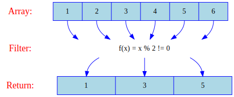
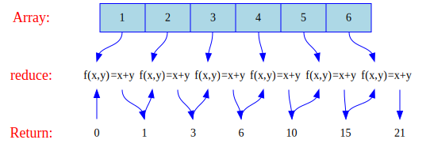
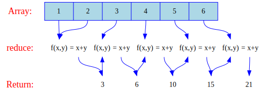

# Array

* [Creating Array](#creating-array)
* [Array Object](#array-object)
  * [Array](#array): [`Array.from()`](#Array.from())
  * [Array Instances](#array-instances)
    * Properties: [`length`](#Array.prototype.length)
    * [Methods Mutator](#mutator-pop-push-reverse-shift-unshift-sort-splice): [`push()`](#arrayprototypepush), [`unshift()`](#arrayprototypeunshift), [`pop()`](#arrayprototypepop), [`shift()`](#arrayprototypeshift), [`reverse()`](#arrayprototypereverse), [`sort()`](#arrayprototypesort), [`splice()`](#arrayprototypesplice)
    * [Methods Accessor](#accessor-includes-join-concat-slice): [`includes()`](#arrayprototypeincludes), [`join()`](#arrayprototypejoin), [`slice()`](#arrayprototypeslice), [`concat()`](#arrayprototypeconcat)
    * [Methods Iteration](#iteration-foreach-reduce-filter-map-every-some-find-reduceright-entries-keys-values): [`map()`](#arrayprototypemap), [`filter()`](#arrayprototypefilter), [`reduce()`](#arrayprototypereduce), [`reduceRight()`](#arrayprototypereduceright), [`forEach()`](#arrayprototypeforeach), [`entries()`](#arrayprototypeentries), [`find()`](#arrayprototypefind), [`every()`](#arrayprototypeevery), [`some()`](#arrayprototypesome)


## Creating Array
---

```js
// Array Literal
let numbers = [1, 2, 4, 7]
console.log(numbers)    //=> [ 1, 2, 4, 7 ]
```

```js
// Array
let numbers = Array(1, 2, 4, 7)
console.log(numbers)    //=> [ 1, 2, 4, 7 ]
```

```js
// Array OO
let numbers = new Array(1, 2, 4, 7)
console.log(numbers)    //=> [ 1, 2, 4, 7 ]

let numbers = new Array(3)
console.log(numbers)    //=> [ , ,  ]

numbers[0] = 1
numbers[1] = 2
numbers[2] = 3
console.log(numbers)    //=> [ 1, 2, 3 ]
```

## Array Object
---

### Array

#### [Array.from()](https://developer.mozilla.org/en-US/docs/Web/JavaScript/Reference/Global_Objects/Array/from)

> Syntax:<br>
>   Array.from(arrayLike)<br>
>   Array.from(arrayLike, mapFn)<br>
>   Array.from(arrayLike, mapFn, thisArg)

```js

Array.from([1, 2, 3]) //=> [1, 2, 3]
```

### Array Instances

#### [Array.prototype.length](https://developer.mozilla.org/en-US/docs/Web/JavaScript/Reference/Global_Objects/Array/leng)

> Syntax:<br>
>   arr.length

```js
console.log([1, 2, 3].length)   //=> 3
```

### Mutator: pop(), push(), reverse(), shift(), unshift(), sort(), splice()

#### [Array.prototype.push()](https://developer.mozilla.org/en-US/docs/Web/JavaScript/Reference/Global_Objects/Array/push)

> Syntax:<br>
>   arr.push(element1, element2,...)

```js
let numbers = [1, 2, 3]

console.log(numbers.push(4))    //=> 4
console.log(numbers)            //=> [ 1, 2, 3, 4 ]
```

#### [Array.prototype.unshift()](https://developer.mozilla.org/en-US/docs/Web/JavaScript/Reference/Global_Objects/Array/unshift)

> Syntax:<br>
>   arr.unshift(element1, element2,...)

```js
let numbers = [1, 2, 3]

console.log(numbers.unshift(0)) //=> 4
console.log(numbers)            //=> [ 0, 1, 2, 3 ]
```

#### [Array.prototype.pop()](https://developer.mozilla.org/en-US/docs/Web/JavaScript/Reference/Global_Objects/Array/pop)

> Syntax:<br>
>   arr.pop()

```js
let numbers = [1, 2, 3]

console.log(numbers.pop())      //=> 3
console.log(numbers)            //=> [ 1, 2 ]
```

#### [Array.prototype.shift()](https://developer.mozilla.org/en-US/docs/Web/JavaScript/Reference/Global_Objects/Array/shift)

> Syntax:<br>
>   arr.shift()

```js
let numbers = [1, 2, 3]

console.log(numbers.shift())    //=> 1
console.log(numbers)            //=> [ 2, 3 ]
```

#### [Array.prototype.reverse()](https://developer.mozilla.org/en-US/docs/Web/JavaScript/Reference/Global_Objects/Array/reverse)

> Syntax:<br>
>   arr.reverse()

```js
let numbers = [1, 2, 3]
console.log(numbers.reverse())  //=> [ 3, 2, 1 ]
console.log(numbers)            //=> [ 3, 2, 1 ]
```

#### [Array.prototype.sort()](https://developer.mozilla.org/en-US/docs/Web/JavaScript/Reference/Global_Objects/Array/sort)

> Syntax:<br>
>   arr.sort()<br>
>   arr.sort(compareFunction)

```js
let numbers = [3, 1, 2]

console.log(numbers.sort())     //=> [ 1, 2, 3 ]
console.log(numbers)            //=> [ 1, 2, 3 ]
```

> References: Merge Sort, Selection Sort<br>
> [Javascript Array.sort implementation?](https://stackoverflow.com/questions/234683/javascript-array-sort-implementation#answer-236534)<br>
> [Algoritmos de ordenação e o seu JavaScript](https://medium.com/tableless/algoritmos-de-ordenação-e-o-seu-javascript-65d50723ae57)<br>
> [Sorting algorithms in JavaScript](https://medium.com/front-end-hacking/sorting-algorithms-in-javascript-2fb985af6880)<br>
> [Programming with JS: Merge Sort](https://hackernoon.com/programming-with-js-merge-sort-deb677b777c0)

#### [Array.prototype.splice()](https://developer.mozilla.org/en-US/docs/Web/JavaScript/Reference/Global_Objects/Array/splice)

> Syntax:<br>
>   arr.splice(start)<br>
>   arr.splice(start, deleteCount)<br>
>   arr.splice(start, deleteCount, item1, item2, ...)

```js
let numbers = [1, 2, 3]

console.log(numbers.splice(1, 2)) //=> [ 2, 3 ]
console.log(numbers)              //=> [1]
```

### Accessor: includes(), join(), concat(), slice()

#### [Array.prototype.includes()](https://developer.mozilla.org/en-US/docs/Web/JavaScript/Reference/Global_Objects/Array/includes)

> Syntax:<br>
>   arr.includes(searchElement)<br>
>   arr.includes(searchElement, fromIndex)

```js
console.log([1, 2, 3].includes(1)) //=> true
```

#### [Array.prototype.join()](https://developer.mozilla.org/en-US/docs/Web/JavaScript/Reference/Global_Objects/Array/join)

> Syntax:<br>
>   arr.join()<br>
>   arr.join(separator)

```js

console.log([1, 2, 3].join(' '))   //=> '1 2 3'
```

#### [Array.prototype.slice()](https://developer.mozilla.org/en-US/docs/Web/JavaScript/Reference/Global_Objects/Array/slice)

> Syntax:<br>
>   arr.slice()<br>
>   arr.slice(begin)<br>
>   arr.slice(begin, end)

```js
console.log([1, 2, 3].slice(1,2))  //=> 2
```

#### [Array.prototype.concat()](https://developer.mozilla.org/en-US/docs/Web/JavaScript/Reference/Global_Objects/Array/concat)

> Syntax:<br>
> var new_array = old_array.concat(value1, value2, ...)

```js
console.log([ 1, 2].concat([ "hello", true, 7 ])) //=> [ 1, 2, 'hello', true, 7 ]
```

### Iteration: forEach(), reduce(), filter(), map(), every(), some(), find(), reduceRight(), entries(), keys(), values()

References:
- [Funny map, reduce, filter](type/ArrayFunny.js)
- [Image Function (Math)](https://en.wikipedia.org/wiki/Image_(mathematics))

#### [Array.prototype.map()](https://developer.mozilla.org/en-US/docs/Web/JavaScript/Reference/Global_Objects/Array/map)

> Syntax:<br>
>   var new_array = arr.map(callback)
>   var new_array = arr.map(callback, thisArg)
><br>
> callback(currentValue, currentIndex, array)<br>

**Double Number**

```
f(x) = 2x
```

Input vs Output

| x | f(x) |
|-|:-:|
| 1 | 2 |
| 2 | 4 |
| 3 | 6 |
| 4 | 8 |
| 5 | 10 |
| 6 | 12 |

Diagram


Code

```js
let array = [1, 2, 3, 4, 5, 6]

// f(x) = 2x
console.log(array.map(value => value * 2)) //=> [ 2, 4, 6, 8, 10, 12 ]
```

#### [Array.prototype.filter()](https://developer.mozilla.org/en-US/docs/Web/JavaScript/Reference/Global_Objects/Array/filter)

> Syntax:<br>
> let new_arr = old_arr.filter(callback)<br>
> let new_arr = old_arr.filter(callback, thisArg)
><br>
> callback(currentValue, currentIndex, array)<br>

**Odd Number**

```
f(x) = x % 2 != 0 
```

Input vs Output

| x | f(x) |
|-|:-:|
| 1 | true |
| 2 | false |
| 3 | true |
| 4 | false |
| 5 | true |
| 6 | false |

Diagram



Code

```js
let array = [1, 2, 3, 4, 5, 6]
console.log(array.filter((value) => value % 2 !== 0)) //=> [ 1, 3, 5 ]
```

**Double Odd Number**

```
f(x) = x % 2 != 0 
g(x) = 2x
```

Input vs Output

| x | f(x) | g(x) |
|-|:-:|:-:|
| 1 | true | 2 |
| 2 | false | |
| 3 | true | 6 |
| 4 | false | |
| 5 | true | 10 |
| 6 | false | |

Diagram


Code

```js
let array = [1, 2, 3, 4, 5, 6]
const result = array
          .filter((value) => value % 2 !== 0)
          .map(e => 2 * e)
console.log(result) //=> [ 2, 6, 10 ]
```

#### [Array.prototype.reduce()](https://developer.mozilla.org/en-US/docs/Web/JavaScript/Reference/Global_Objects/Array/reduce)

Reference: [doc](https://developer.mozilla.org/en-US/docs/Web/JavaScript/Reference/Global_Objects/Array/Reduce)

> Syntax:<br>
>   arr.reduce(callback)<br>
>   arr.reduce(callback, initialValue)<br>
><br>
> callback(accumulator, currentValue, currentIndex, array)<br>

**Sum Array (zero)**

```
f(x, y) = x + y
```

Input vs Output

| x | y | f(x, y) |
|-|-|:-:|
| 0 | 1 | 1 |
| 1 | 2 | 3 |
| 3 | 3 | 6 |
| 6 | 4 | 10 |
| 10 | 5 | 15 |
| 15 | 6 | 21 |

Diagram



Code

```js
let array = [1, 2, 3, 4, 5, 6]

console.log(array.reduce((addition, value) => addition + value, 0)) //=> 21
```

**Sum Array**

```
f(x, y) = x + y
```

Input vs Output

| x | y | f(x, y) |
|-|-|:-:|
| 1 | 2 | 3 |
| 3 | 3 | 6 |
| 6 | 4 | 10 |
| 10 | 5 | 15 |
| 15 | 6 | 21 |

Diagram



Code

```js
let array = [1, 2, 3, 4, 5, 6]

console.log(array.reduce((addition, value) => addition + value))    //=> 21
```

**Product**

```js
let array = [1, 2, 3, 4, 5, 6]

console.log(array.reduce((addition, value) => addition * value), 1)    //=> 720
```

#### [Array.prototype.reduceRight()](https://developer.mozilla.org/en-US/docs/Web/JavaScript/Reference/Global_Objects/Array/reduceRight)

> Syntax:<br>
>   arr.reduceRight(callback)<br>
>   arr.reduceRight(callback, initialValue)
><br>
> callback(currentValue, currentIndex, array)<br>

```js
let array = [1, 2, 3, 4, 5, 6]
console.log(array.reduceRight((addition, value) => addition + value)) //=> 21
```

#### [Array.prototype.forEach()](https://developer.mozilla.org/en-US/docs/Web/JavaScript/Reference/Global_Objects/Array/forEach)

> Syntax:<br>
>   arr.forEach(callback)
>   arr.forEach(callback, thisArg)
><br>
> callback(currentValue, currentIndex, array)<br>

```js
[1, 2, 3].forEach(function(value){console.log(value)})
[1, 2, 3].forEach((value) => console.log(value))
[1, 2, 3].forEach(value => console.log(value))
//=>
// '1'
// '2'
// '3'
```

```js
[1, 2, 3].forEach(function(value, index){console.log(value+' '+index)})
[1, 2, 3].forEach((value, index) => console.log(value+' '+index))
//=>
// '0 => 1'
// '1 => 2'
// '2 => 3'
```

#### [Array.prototype.entries()](https://developer.mozilla.org/en-US/docs/Web/JavaScript/Reference/Global_Objects/Array/entries)

> Syntax:<br>
>   arr.entries()

```js
for([key, value] of [1,2,3].entries()){console.log(`${key} => ${value}`)}
//=>
// '0 => 1'
// '1 => 2'
// '2 => 3'
```

#### [Array.prototype.find()](https://developer.mozilla.org/en-US/docs/Web/JavaScript/Reference/Global_Objects/Array/find)

> Syntax:<br>
>   arr.find(callback)<br>
>   arr.find(callback, thisArg)
><br>
> callback(currentValue, currentIndex, array)<br>

```js
let array = [1, 2, 3, 4, 5, 6]
console.log(array.find((value) => value % 2 == 0)) //=> 2
```

#### [Array.prototype.every()](https://developer.mozilla.org/en-US/docs/Web/JavaScript/Reference/Global_Objects/Array/every)

> Syntax:<br>
>   arr.every(callback)<br>
>   arr.every(callback, thisArg)
><br>
> callback(currentValue, currentIndex, array)<br>

```js
let array = [1, 2, 3, 4, 5, 6]
console.log(array.every((value) => value % 2 ==0)) //=> false
```

```js
let array = [2, 4, 6]
console.log(array.every((value) => value % 2 ==0)) //=> true
```

#### [Array.prototype.some()](https://developer.mozilla.org/en-US/docs/Web/JavaScript/Reference/Global_Objects/Array/some)

> Syntax:<br>
>   arr.some(callback)<br>
>   arr.some(callback, thisArg)
><br>
> callback(currentValue, currentIndex, array)<br>

```js
let array = [1, 2, 3, 4, 5, 6]
console.log(array.some((value) => value % 2 == 0)) //=> true
```