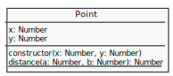
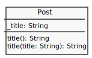
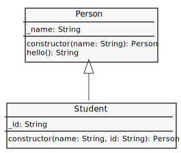

# Classes

* [Syntax](#syntax)
* [Prototype methods](#prototpy-methodos)
* [Static methods](#static-methods)
* [Getters & Setters](#getters-and-setters)
* [References](#references)

## Syntax
---

### Prototype properties


```js
class Post {
  constructor(title, text){
    this.title = title
    this.text = text
  }
}

let post = new Post('Lorem ipsum dolor', 'Nunc accumsan in ipsum a mattis...')

console.log(post) //=> Post { title: 'Lorem ipsum dolor', text: 'Nunc accumsan in ipsum a mattis...'
```

### Prototype methods


```js
class Post {
  constructor(title, text){
    this.title = title
    this.text = text
  }

  toHMTL(){
    return `<div><h1>${this.title}</h1><p>${this.text}</p></div>`
  }
}

var post = new Post('Lorem ipsum dolor', 'Nunc accumsan in ipsum a mattis...')

console.log(post)          //=> Post { title: 'Lorem ipsum dolor', text: 'Nunc accumsan in ipsum a mattis...'
console.log(post.toHMTL()) //=> <div><h1>Lorem ipsum dolor</h1><p>Nunc accumsan in ipsum a mattis...</p></div>
```

### Static methods



```js
class Point {
  constructor(x, y) {
    this.x = x
    this.y = y
  }

  static distance(a, b) {
    const dx = a.x - b.x
    const dy = a.y - b.y
    return Math.sqrt(dx*dx + dy*dy)
  }
}

const p1 = new Point(5, 5)
const p2 = new Point(10, 10)

console.log(Point.distance(p1, p2)) //=> 7.0710678118654755
```

### getters and setters



```js
class Post {
  get title() {
    return this._title
  }
  set title(title) {
    this._title = title
  }
}
var post = new Post()

console.log(post)       //=> Post {}

// set
post.title = 'lorem ipsum dolor'

console.log(post)       //=> Post { _title: 'lorem ipsum dolor' }
console.log(post.title) //=> 'lorem ipsum dolor' / get
```

### Sub classing with extends / old prototype



```js
class Person {
  constructor(name) {
    this._name = name
  }

  hello(){
    return `Hello: ${this._name}`
  }
}

class Student extends Person {
  constructor(name, id){
    super(name)
    this._id = id
  }
}

let student = new Student('fulano', 10)

console.log(student.hello()) //=> 'Hello: fulano'
```

### Abstract subclasses or mix-ins


```js
let CalculatorMixin = Base => class extends Base {
  addition(a, b) { 
    return a + b 
  }

  subtraction(a, b) { 
    return a - b 
  }
}

let RandomizerMixin = Base => class extends Base {
  random() { 
    return Math.random() 
  }

  randomRange(min, max) { 
    return Math.random() * (max - min) + min 
  }
}

class Util extends CalculatorMixin(RandomizerMixin(Object)) { 
  multiplication(a, b) { 
    return a * b 
  }
}

const util = new Util()

console.log(util.randomRange(1,10))   //=> 2.2857742766885556
console.log(util.subtraction(100,10)) //=> 90
```

Reference: 
* [Mixins with JS](http://justinfagnani.com/2015/12/21/real-mixins-with-javascript-classes/)

## References
---
* [Statements Class \| MDN](https://developer.mozilla.org/en-US/docs/Web/JavaScript/Reference/Statements/class)
* [Defining Classes \| MDN](https://developer.mozilla.org/en-US/docs/Web/JavaScript/Reference/Classes)
* [Classes \| Exploring JS](http://exploringjs.com/es6/ch_classes.html)
* [Object-oriented JavaScript: A Deep Dive into ES6 Classes \| Sitepoint](https://www.sitepoint.com/object-oriented-javascript-deep-dive-es6-classes/)
* [JavaScript ES6 Class Syntax](https://coryrylan.com/blog/javascript-es6-class-syntax)
* [Classes ES6][https://googlechrome.github.io/samples/classes-es6/)