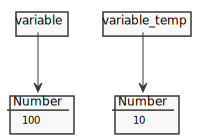
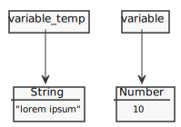
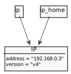
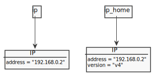

# Reference / Value

* [Primitives values are passed by value](#primitives-values-are-passed-by-value)
* [Object values are passed by reference](#object-values-are-passed-by-reference)
* [Clone Object](#clone-object)

## Primitives values are passed by value
---

Primitives values (boolean, null, undefined, number, string, symbol)

```js
let variable = 10

// copy value
let variable_temp = variable

console.log(variable)        //=> 10
console.log(variable_temp)   //=> 10

variable = 100

console.log(variable)        //=> 100
console.log(variable_temp)   //=> 10
```



```js
let variable = new String("lorem ipsum")

// copy value
let variable_temp = variable

console.log(variable)         //=> [String: 'lorem ipsum']
console.log(variable_temp)    //=> [String: 'lorem ipsum']

variable = 10

console.log(variable)         //=> 10
console.log(variable_temp)    //=> [String: 'lorem ipsum']
```



## Object values are passed by reference
---

```js
let ip = {address: '192.168.0.2'}

// copy reference
let ip_home = ip

console.log(ip)       //=> { address: '192.168.0.2' }
console.log(ip_home)  //=> { address: '192.168.0.2' }

ip_home.version = 4

console.log(ip)       //=> { address: '192.168.0.2', version: 4 }
console.log(ip_home)  //=> { address: '192.168.0.2', version: 4 }

ip_home.address = '192.168.0.3'

console.log(ip)       //=> { address: '192.168.0.3', version: 4 }
console.log(ip_home)  //=> { address: '192.168.0.3', version: 4 }
```



## Clone Object
---

```js
let ip = {address: '192.168.0.2'}

// copy value
// let ip_clone = JSON.parse(JSON.stringify(ip))
let ip_clone = Object.assign({}, ip) // copy value ES6

console.log(ip) //=> { address: '192.168.0.2' }
console.log(ip_clone) //=> { address: '192.168.0.2' }

ip_clone.version = 4

console.log(ip) //=> { address: '192.168.0.2' }
console.log(ip_clone) //=> { address: '192.168.0.2', version: 4 }
```



## Array.prototype.map: Reference vs Value
---

```js
const array = [1, 2, 3, 4]
array.map(e => e = 1)    //=> [ 1, 1, 1, 1 ]
console.log(array)       //=> [ 1, 2, 3, 4 ]
```

```js
const array = [{a: 1}, {b:2}, {c:3}, {d:4}]
array.map(e => e.e = 5)  //=> [ 5, 5, 5, 5 ]
console.log(array)       //=> [ { a: 1, e: 5 }, { b: 2, e: 5 }, { c: 3, e: 5 }, { d: 4, e: 5 } ]
```

## References
---

* [Primitive](https://developer.mozilla.org/en-US/docs/Web/JavaScript/Data_structures#Primitive_values)
* [Data Structures and Types](https://developer.mozilla.org/en-US/docs/Web/JavaScript/Guide/Grammar_and_Types#Data_structures_and_types)