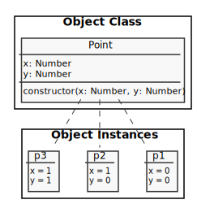

# Object

- [Defined Data Type](#defined-data-type)
  - [Like Struct / Dictionary](#like-struct--dictionary)
  - [Like Object (Class)](#like-object-class)
- [Class vs Instance](#class-vs-instance)
- [Object Properties](#object-properties)
  - [Post Data](#post-data) ([JSON](#post-json), [Object](#post-object), [Constructor function](#post-constructor-function), [class](post-class))
- [Object Methods](#object-methods)
  - [Person Data](#person-data) ([JSON](#person-json), [Object](#person-object), [Constructor function](#person-constructor-function), [class](#person-class))
- [Prototype](#prototype)
- [Changing Object](#changing-object)
- [Object Array Interaction](#object-array-interaction)
- [Object Interaction](#object-interaction)
- [References](#references)

## Defined Data Type

---

### Like Struct / Dictionary


`point.c`:

```c
#include <stdio.h>

typedef struct {
   int x;
   int y;
} point;

int main() {
  point p = { 1, 3 };

  printf("x:%d, y:%d", p.x, p.y);   //=> 1, 3

  return 0;
}
```

`point.py`:

```py
p = {"x":1, "y":3}
print("%d, %d" % (p["x"], p["y"]))  //=> 1, 3
```

`point.js`:

```js
const p = { x: 1, y: 3 };
console.log(`${p.x}, ${p.y}`); //=> 1, 3
```

### Like Object (Class)

`point-object.py` :

```py
class Point:

  def __init__(self, x, y):
    self.x = x
    self.y = y


p = Point(x=1, y=3)
print("%d, %d" % (p.x, p.y))   //=> 1, 3
```

`point-object.js` :

```js
class Point {
  constructor(x, y) {
    this.x = x;
    this.y = y;
  }
}

const p = new Point(1, 3);
console.log(`${p.x}, ${p.y}`); //=> 1, 3
```

## Class vs Instance

---



### Object Class

```js
class Point {
  constructor(x, y) {
    this.x = x;
    this.y = y;
  }
}
```

### Object Instances

```js
const p1 = new Point(0, 0);
const p2 = new Point(1, 0);
const p3 = new Point(1, 1);
```

## Object Properties

---

### Post Data


#### Post JSON

```js
const post = {
  title: 'Lorem ipsum dolor',
  text: 'Nunc accumsan in ipsum a mattis...',
};

console.log(post); //=> { title: 'Lorem ipsum dolor', text: 'Nunc accumsan in ipsum a mattis...' }
console.log(post.title); //=> 'Lorem ipsum dolor'
console.log(post['title']); //=> 'Lorem ipsum dolor'
console.log(typeof post); //=> object
```

#### Post Object

```js
let post = new Object();
post.title = 'Lorem ipsum dolor';
post.text = 'Nunc accumsan in ipsum a mattis...';

console.log(post); //=> { title: 'Lorem ipsum dolor', text: 'Nunc accumsan in ipsum a mattis...' }
console.log(typeof post); //=> object
```

#### Post Constructor function (lexical this)

```js
function Post(title, text) {
  this.title = title;
  this.text = text;
}

let postLorem = new Post('Lorem ipsum dolor', 'Nunc accumsan in ipsum a mattis...');
console.log(postLorem); //=> Post { title: 'Lorem ipsum dolor', text: 'Nunc accumsan in ipsum a mattis...' }
console.log(typeof postLorem); //=> object

let postIF = new Post('IFPB', 'Outro texto...');
console.log(postIF); //=> { title: 'IFPB', text: 'Outro texto...' }
console.log(typeof postIF); //=> object
```

#### Post class

```js
class Post {
  constructor(title, text) {
    this.title = title;
    this.text = text;
  }
}

let post = new Post('Lorem ipsum dolor', 'Nunc accumsan in ipsum a mattis...');

console.log(post); //=> Post { title: 'Lorem ipsum dolor', text: 'Nunc accumsan in ipsum a mattis...' }
console.log(typeof post); //=> object
```

## Object Methods

---

### Person Data


```js
const person = console.log(person.toHTML()); // creating Person (name: Fulano; email: fulano@email.com)
//=> <div><h1>Fulano</h1><p>fulano@email.com</p></div>
```

#### Person JSON

```js
let person = {
  name: 'Fulano',
  email: 'fulano@email.com',
  toHTML: function() {
    return `<div><h1>${this.name}</h1><p>${this.email}</p></div>`;
  },
};

// Arrow functions do not define ('bind') their own this
// toHTML: () => `<div><h1>${this.name}</h1><p>${this.email}</p></div>`

console.log(person.toHTML());
//=> '<div><h1>Fulano</h1><p>fulano@email.com</p></div>'
```

#### Person Object

```js
let person = new Object();

person.name = 'Fulano';
person.email = 'fulano@email.com';
person.toHTML = function() {
  return `<div><h1>${this.name}</h1><p>${this.email}</p></div>`;
};

console.log(person.toHTML());
//=> '<div><h1>Fulano</h1><p>fulano@email.com</p></div>'
```

#### Person Constructor Function

```js
function Person(name, email) {
  this.name = name;
  this.email = email;
  this.toHTML = function() {
    return `<div><h1>${this.name}</h1><p>${this.email}</p></div>`;
  };
}

let person = new Person('Fulano', 'fulano@email.com');

console.log(person.toHTML());
//=> '<div><h1>Fulano</h1><p>fulano@email.com</p></div>'
```

#### Person Class

```js
class Person {
  constructor(name, email) {
    this.name = name;
    this.email = email;
  }

  toHTML() {
    return `<div><h1>${this.name}</h1><p>${this.email}</p></div>`;
  }
}

const person = new Person('Fulano', 'fulano@email.com');

console.log(person.toHTML());
//=> '<div><h1>Fulano</h1><p>fulano@email.com</p></div>'
```

## Prototype

---

```js
const lorem = new String('lorem ipsum dolor');

lorem.toSnakeCase = function() {
  return this.replace(/\s/g, '_');
};

console.log(lorem.toSnakeCase()); //=> 'outro_lorem_ipsum'

const lorem2 = new String('outro lorem ipsum dolor');
console.log(lorem2.toSnakeCase()); // TypeError
```

```js
String.prototype.toSnakeCase = function() {
  return this.replace(/\s/g, '_');
};

const lorem = new String('lorem ipsum');
console.log(lorem.toSnakeCase()); //=> 'lorem_ipsum'

const lorem2 = new String('outro lorem ipsum dolor');
console.log(lorem2.toSnakeCase()); //=> 'outro_lorem_ipsum'
```

## Changing Object

---


```js
const ip = { address: '192.168.0.2', mask: '255.255.255.0' };

console.log(ip); //=> { address: '192.168.0.2', mask: '255.255.255.0' }

// adding property
ip.version = 'v6';
console.log(ip); //=> { address: '192.168.0.2', mask: '255.255.255.0', version: 'v6' }
console.log(ip.version); //=> 'v6'

// changing property
ip.version = 'v4';
console.log(ip); //=> { address: '192.168.0.2', mask: '255.255.255.0', version: 'v4' }
console.log(ip.version); //=> 'v4'

// adding object
ip.gateway = { ip: '192.168.0.254', mask: '255.255.255.0' };

console.log(ip); //=> { address: '192.168.0.2', mask: '255.255.255.0', version: 'v4', gateway: { ip: '192.168.0.254', mask: '255.255.255.0' } }

console.log(ip.gateway.ip); //=> '192.168.0.254'
console.log(ip['gateway']['ip']); //=> '192.168.0.254'

// Deleting properties
delete ip.gateway;
console.log(ip); //=> { address: '192.168.0.2', mask: '255.255.255.0', version: 'v4' }
console.log(ip.gateway); //=> undefined
```

## Object Array Interaction

---

```js
const ips = [
  { address: '192.168.0.2', mask: '255.255.255.0' },
  { address: '192.168.0.10', mask: '255.255.255.0' },
  { address: '192.168.0.26', mask: '255.255.255.0' },
  { address: '192.168.0.30', mask: '255.255.255.0' },
];

for (let ip of ips) {
  // console.log(ip['address']+'/'+ip['mask'])
  console.log(ip.address + '/' + ip.mask);
}
//=>
// 192.168.0.2/255.255.255.0
// 192.168.0.10/255.255.255.0
// 192.168.0.26/255.255.255.0
// 192.168.0.30/255.255.255.0
```

```js
const ips = [
  { address: '192.168.0.2', mask: '255.255.255.0' },
  { address: '192.168.0.10', mask: '255.255.255.0' },
  { address: '192.168.0.26', mask: '255.255.255.0' },
  { address: '192.168.0.30', mask: '255.255.255.0' },
];

result = '<table>\n';
for (let ip of ips) {
  result += '  <tr><td>' + ip.address + '</td><td>' + ip.mask + '</td></tr>\n';
}
result += '</table>\n';

console.log(result);
//=>
// <table>
//   <tr><td>192.168.0.2</td><td>255.255.255.0</td></tr>
//   <tr><td>192.168.0.10</td><td>255.255.255.0</td></tr>
//   <tr><td>192.168.0.26</td><td>255.255.255.0</td></tr>
//   <tr><td>192.168.0.30</td><td>255.255.255.0</td></tr>
// </table>
```

## Object Interaction

---

### Keys

#### for...in

```js
const posts = {
  title: 'lorem ipsum dolor',
  text: 'Nunc accumsan in ipsum a mattis...',
};

for (let field in posts) {
  console.log(posts[field]);
}
//=>
// 'lorem ipsum dolor',
// 'Nunc accumsan in ipsum a mattis...'

for (let field of posts) {
  // TypeError: posts[Symbol.iterator] is not a function
  console.log(field);
}
```

#### for..of - Object.keys()

```js
const posts = {
  title: 'lorem ipsum dolor',
  text: 'Nunc accumsan in ipsum a mattis...',
};

for (let field of Object.keys(posts)) {
  console.log(posts[field]);
}
//=>
// 'lorem ipsum dolor',
// 'Nunc accumsan in ipsum a mattis...'
```

### Values

#### for..of

```js
const posts = {
  title: 'lorem ipsum dolor',
  text: 'Nunc accumsan in ipsum a mattis...',
};

for (let value of posts) {
  console.log(value);
}
//=> TypeError: posts is not iterable
```

#### for..of - Object.values()

```js
const posts = {
  title: 'lorem ipsum dolor',
  text: 'Nunc accumsan in ipsum a mattis...',
};

for (let value of Object.values(posts)) {
  console.log(value);
}
//=>
// 'lorem ipsum dolor',
// 'Nunc accumsan in ipsum a mattis...'
```

#### for..of - destructuring assignment

```js
const posts = [
  {
    title: 'lorem ipsum dolor',
    text: 'Nunc accumsan in ipsum a mattis...',
    author: {
      name: 'Alice',
      email: 'alice@email.com',
    },
  },
  {
    title: 'Ipsum dolor',
    text: 'Accumsan in ipsum a mattis...',
    author: {
      name: 'Bob',
      email: 'bob@email.com',
    },
  },
];

for (let {
  title: t,
  author: { name: n },
} of posts) {
  console.log(`${t} (${n})`);
}
//=>
// lorem ipsum dolor (Alice)
// Ipsum dolor (Bob)
```

### Key & Value

#### for..of - Object.entries()

```js
const posts = {
  title: 'lorem ipsum dolor',
  text: 'Nunc accumsan in ipsum a mattis...',
};

for (let field of Object.entries(posts)) {
  console.log(field);
}
//=>
// 'lorem ipsum dolor',
// 'Nunc accumsan in ipsum a mattis...'
```

> Enumerating all properties of an object (`for...in`, `Object.keys()`, `Object.values()`, `Object.getOwnPropertyNames()`)

## References

---

- [Global Object](https://developer.mozilla.org/en-US/docs/Web/JavaScript/Reference/Global_Objects/Object)
- [Object Oriented](https://developer.mozilla.org/en-US/docs/Web/JavaScript/Introduction_to_Object-Oriented_JavaScript)
- [Object Literals](https://developer.mozilla.org/en-US/docs/Web/JavaScript/Guide/Grammar_and_types#Object_literals)
- [Working with Objects](https://developer.mozilla.org/en-US/docs/Web/JavaScript/Guide/Working_with_Objects)
- [Details of the Object Model](https://developer.mozilla.org/en-US/docs/Web/JavaScript/Guide/Details_of_the_Object_Model)
