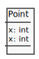
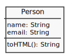
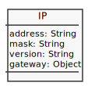

# Object

* [Object Properties](#object-properties)
  * [Post Data](#post-data): JSON, Object, Constructor function, class
* [Object Methods](#object-methods)
  * [Person Data](#person-data): JSON, Object, Constructor function, class
* [Prototype](#prototype)
* [Changing Object](#changing-object)
* [Interaction](#interaction)
* [Array of Objects](#array-of-objects)

## Reference
---

* [Global Object](https://developer.mozilla.org/en-US/docs/Web/JavaScript/Reference/Global_Objects/Object)
* [Object Oriented](https://developer.mozilla.org/en-US/docs/Web/JavaScript/Introduction_to_Object-Oriented_JavaScript)
* [Object Literals](https://developer.mozilla.org/en-US/docs/Web/JavaScript/Guide/Grammar_and_types#Object_literals)
* [Working with Objects](https://developer.mozilla.org/en-US/docs/Web/JavaScript/Guide/Working_with_Objects)
* [Details of the Object Model](https://developer.mozilla.org/en-US/docs/Web/JavaScript/Guide/Details_of_the_Object_Model)

## Object Properties
---

#### Multiple Types / Like Struct C / Like Array JS



```c
#include <stdio.h>

typedef struct {
   int x;
   int y;
} point;

int main() {
  point p = { 1, 3 };

  printf("x:%d, y:%d", p.x, p.y);

  return 0;
}
```

#### Post Data


#### Post JSON

```js
let post = {
  title: 'Lorem ipsum dolor',
  text: 'Nunc accumsan in ipsum a mattis...'
}

console.log(post)          //=> { title: 'Lorem ipsum dolor', text: 'Nunc accumsan in ipsum a mattis...' }
console.log(post.title)    //=> 'Lorem ipsum dolor'
console.log(post['title']) //=> 'Lorem ipsum dolor'
console.log(typeof post)   //=> object
```

#### Post Object

```js
let post = new Object()
post.title = 'Lorem ipsum dolor'
post.text = 'Nunc accumsan in ipsum a mattis...'

console.log(post)        //=> { title: 'Lorem ipsum dolor', text: 'Nunc accumsan in ipsum a mattis...' }
console.log(typeof post) //=> object
```

#### Post Constructor function (lexical this)

```js
function Post(title, text){
  this.title = title
  this.text = text
}

let postLorem = new Post('Lorem ipsum dolor', 'Nunc accumsan in ipsum a mattis...')
console.log(postLorem)        //=> Post { title: 'Lorem ipsum dolor', text: 'Nunc accumsan in ipsum a mattis...' }
console.log(typeof postLorem) //=> object

let postIF = new Post('IFPB', 'Outro texto...')
console.log(postIF)        //=> { title: 'IFPB', text: 'Outro texto...' }
console.log(typeof postIF) //=> object
```

#### Post class

```js
class Post {
  constructor(title, text){
    this.title = title;
    this.text = text;
  }
}

let post = new Post('Lorem ipsum dolor', 'Nunc accumsan in ipsum a mattis...')

console.log(post)        //=> Post { title: 'Lorem ipsum dolor', text: 'Nunc accumsan in ipsum a mattis...' }
console.log(typeof post) //=> object
```

### Object Methods

#### Person Data



```
console.log(person.toHTML())
//=> <div><h1>Name</h1><p>Email</p></div>
```

#### Person JSON

```js
let person = {
  name: 'Fulano',
  email: 'fulano@email.com',
  toHTML: function(){ return `<div><h1>${this.name}</h1><p>${this.email}</p></div>` }
}

// Arrow functions do not define ('bind') their own this
// toHTML: () => `<div><h1>${this.name}</h1><p>${this.email}</p></div>`

console.log(person.toHTML())
//=> '<div><h1>Fulano</h1><p>fulano@email.com</p></div>'
```

#### Person Object

```js
let person = new Object()

person.name = 'Fulano'
person.email = 'fulano@email.com'
person.toHTML = function(){ return `<div><h1>${this.name}</h1><p>${this.email}</p></div>` }

console.log(person.toHTML())
//=> '<div><h1>Fulano</h1><p>fulano@email.com</p></div>'
```

#### Person Constructor Function

```js
function Person(name, email){
  this.name = name
  this.email = email
  this.toHTML = function(){ return `<div><h1>${this.name}</h1><p>${this.email}</p></div>` }
}

let person = new Person('Fulano', 'fulano@email.com')

console.log(person.toHTML())
//=> '<div><h1>Fulano</h1><p>fulano@email.com</p></div>'
```

#### Person Class

```js
class Person {
  constructor(name, email){
    this.name = name
    this.email = email
  }

  toHTML(){
    return `<div><h1>${this.name}</h1><p>${this.email}</p></div>`
  }
}

const person = new Person('Fulano', 'fulano@email.com')

console.log(person.toHTML())
//=> '<div><h1>Fulano</h1><p>fulano@email.com</p></div>'
```

### Prototype

```js
String.prototype.toSnakeCase = function(){
  return this.replace(/\s/g, '_')
}

console.log(new String('lorem ipsum').toSnakeCase())       //=> 'lorem_ipsum'
console.log(new String('outro lorem ipsum').toSnakeCase()) //=> 'outro_lorem_ipsum'
```

#### Instance

```js
let lorem = new String('lorem ipsum dolor')

lorem.toSnakeCase = function(){
  return this.replace(/\s/g, '_')
}
console.log(lorem.toSnakeCase()) //=> 'outro_lorem_ipsum'

let lorem2 = new String('outro lorem ipsum dolor')
// console.log(lorem2.toSnakeCase()) // TypeError
```

### Changing Object



```js
const ip = { address: '192.168.0.2', mask: '255.255.255.0' }

console.log(ip)                  //=> { address: '192.168.0.2', mask: '255.255.255.0' }

// adding property
ip.version = 'v6'
console.log(ip)                  //=> { address: '192.168.0.2', mask: '255.255.255.0', version: 'v6' }
console.log(ip.version)          //=> 'v6'

// changing property
ip.version = 'v4'
console.log(ip)                  //=> { address: '192.168.0.2', mask: '255.255.255.0', version: 'v4' }
console.log(ip.version)          //=> 'v4'

// adding object
ip.gateway = { ip: '192.168.0.254', mask: '255.255.255.0' }

console.log(ip)                  //=> { address: '192.168.0.2', mask: '255.255.255.0', version: 'v4', gateway: { ip: '192.168.0.254', mask: '255.255.255.0' } }

console.log(ip.gateway.ip)       //=> '192.168.0.254'
console.log(ip['gateway']['ip']) //=> '192.168.0.254'

// Deleting properties
delete ip.gateway
console.log(ip)                  //=> { address: '192.168.0.2', mask: '255.255.255.0', version: 'v4' }
console.log(ip.gateway)          //=> undefined
```

### Interaction

Enumerating all properties of an object (`for...in`, `Object.keys()`, `Object.values()`, `Object.getOwnPropertyNames()`)

```js
// for...in
let post = {
  title: 'lorem ipsum dolor',
  text: 'Nunc accumsan in ipsum a mattis...'
}

for(let field in post){
  console.log(posts[field])
}
//=>
// 'lorem ipsum dolor',
// 'Nunc accumsan in ipsum a mattis...'

// TypeError: post[Symbol.iterator] is not a function
// for(let field of post){
//   console.log(field)
// }
```

```js
// Object.keys()
let post = {
  title: 'lorem ipsum dolor',
  text: 'Nunc accumsan in ipsum a mattis...'
}
for(let field of Object.keys(post)){
  console.log(post[field])
}
//=>
// 'lorem ipsum dolor',
// 'Nunc accumsan in ipsum a mattis...'
```

```js
// for..of, Object.entries()
let post = {
  title: 'lorem ipsum dolor',
  text: 'Nunc accumsan in ipsum a mattis...'
}

for(let field of Object.entries(post)){
  console.log(field)
}
//=>
// 'lorem ipsum dolor',
// 'Nunc accumsan in ipsum a mattis...'
```

```js
// for..of, Object.entries()
let people = [
  {
    name: 'Mike Smith',
    family: {
      mother: 'Jane Smith',
      father: 'Harry Smith',
      sister: 'Samantha Smith'
    },
    age: 35
  },
  {
    name: 'Tom Jones',
    family: {
      mother: 'Norah Jones',
      father: 'Richard Jones',
      brother: 'Howard Jones'
    },
    age: 25
  }
]

for (let {name: n, family: { father: f } } of people) {
  console.log('Name: ' + n + ', Father: ' + f)
}
//=>
// Name: Mike Smith, Father: Harry Smith
// Name: Tom Jones, Father: Richard Jones
```

### Array of Objects

```js
let ips = [
  {address: "192.168.0.2", mask: "255.255.255.0"},
  {address: "192.168.0.10", mask: "255.255.255.0"},
  {address: "192.168.0.26", mask: "255.255.255.0"},
  {address: "192.168.0.30", mask: "255.255.255.0"}
]

for(let ip of ips){
  // console.log(ip['address']+'/'+ip['mask'])
  console.log(ip.address+'/'+ip.mask)
}
//=>
// 192.168.0.2/255.255.255.0
// 192.168.0.10/255.255.255.0
// 192.168.0.26/255.255.255.0
// 192.168.0.30/255.255.255.0
```

```js
let ips = [
  {address: "192.168.0.2", mask: "255.255.255.0"},
  {address: "192.168.0.10", mask: "255.255.255.0"},
  {address: "192.168.0.26", mask: "255.255.255.0"},
  {address: "192.168.0.30", mask: "255.255.255.0"}
]

let row = ''

for(let ip of ips){
  for(let key of Object.keys(ip)){
    row += ip[key]+' '
  }
}

console.log(row)
//=> 192.168.0.2 255.255.255.0 192.168.0.10 255.255.255.0 192.168.0.26 255.255.255.0 192.168.0.30 255.255.255.0
```

```js
let ips = [
  {address: "192.168.0.2", mask: "255.255.255.0"},
  {address: "192.168.0.10", mask: "255.255.255.0"},
  {address: "192.168.0.26", mask: "255.255.255.0"},
  {address: "192.168.0.30", mask: "255.255.255.0"}
]

result = '<table>\n'
for(let ip of ips){
  result += '  <tr><td>'+ip.address+'</td><td>'+ip.mask+'</td></tr>\n'
}
result += '</table>\n'

console.log(result)
//=>
// <table>
//   <tr><td>192.168.0.2</td><td>255.255.255.0</td></tr>
//   <tr><td>192.168.0.10</td><td>255.255.255.0</td></tr>
//   <tr><td>192.168.0.26</td><td>255.255.255.0</td></tr>
//   <tr><td>192.168.0.30</td><td>255.255.255.0</td></tr>
// </table>
```
