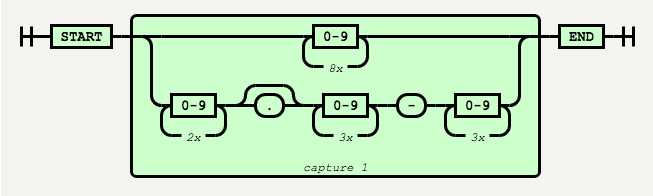
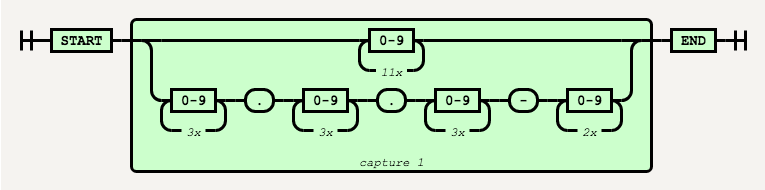
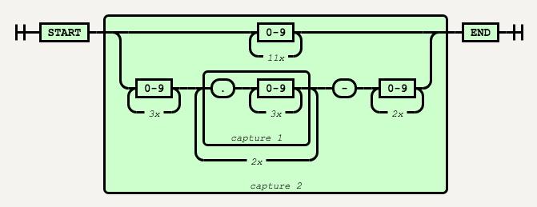
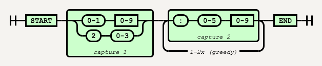
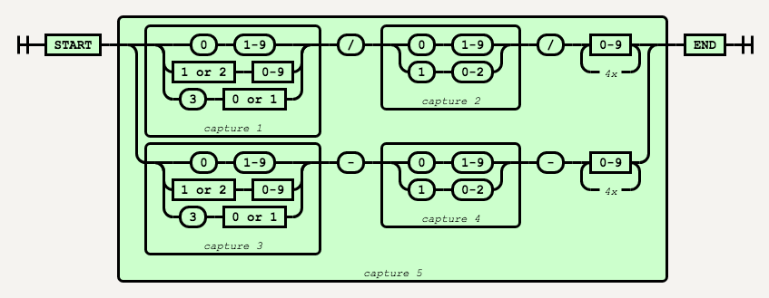
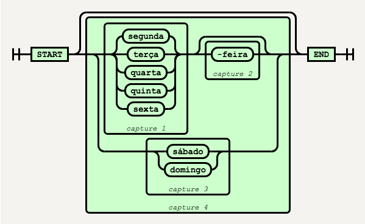
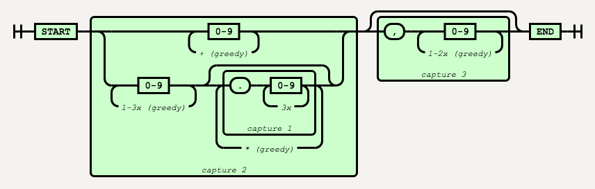

# Patterns

* [Byte](#byte)
* [CEP](#cep)
* [Hexa Number](#hexa-number)
* [IP](#ip)
* [CPF](#cpf)
* [Hour](#hour)
* [Date (locale pt-BR)](#date-locale-pt-br)
* [Week Name (locale pt-BR)](#week-name-locale-pt-br)
* [Number (locale pt-BR)](#number-locale-pt-br)
* [Currency (locale pt-BR)](#currency-locale-pt-br)
* [Phone (locale pt-BR)](#phone-locale-pt-br)
* [User](#user)
* [URL](#url)
* [Email](#email)
* [Password](#password)

## Byte
---

### /[01]{8}/


```js
let pattern = /[01]{8}/
console.log(pattern.test('01010101'))      //=> true
console.log(pattern.test('11110000'))      //=> true
console.log(pattern.test('11110002'))      //=> false
```

## CEP
---

### /^(\d{8}|\d{2}\.?\d{3}-\d{3})$/



```js
let pattern = /^(\d{8}|\d{2}\.?\d{3}-\d{3})$/
console.log(pattern.test('01001000'))       //=> true
console.log(pattern.test('01001-000'))      //=> true
console.log(pattern.test('01.001-000'))     //=> true
console.log(pattern.test('a01001000'))      //=> false
console.log(pattern.test('01-001.000'))     //=> false
console.log(pattern.test('01.001000'))      //=> false
```

## Hexa Number
---

### /^0[xX][\dA-Fa-f]+$/


```js
let pattern = /^0[xX][\dA-Fa-f]+$/
console.log(pattern.test('0x1f'))            //=> true
console.log(pattern.test('0x1F'))            //=> true
console.log(pattern.test('0X1f'))            //=> true
console.log(pattern.test('0X1FFFF'))         //=> true
console.log(pattern.test('01FFFF'))          //=> false
```

## IP
---

### /^\d{1,3}\.\d{1,3}\.\d{1,3}\.\d{1,3}$/


```js
let pattern = /^\d{1,3}\.\d{1,3}\.\d{1,3}\.\d{1,3}$/
console.log(pattern.test('255.255.255.255')) //=> true
console.log(pattern.test('192.168.0.1'))     //=> true
console.log(pattern.test('10.0.24.1'))       //=> true
console.log(pattern.test('8.8.8.8'))         //=> true
console.log(pattern.test('300.8.8.8'))       //=> true?
```

### /^(\d{1,3}\.){3}\d{1,3}$/


```js
let pattern = /^(\d{1,3}\.){3}\d{1,3}$/
console.log(pattern.test('255.255.255.255')) //=> true
console.log(pattern.test('192.168.0.1'))     //=> true
console.log(pattern.test('10.0.24.1'))       //=> true
console.log(pattern.test('8.8.8.8'))         //=> true
```

## CPF
---

### /^(\d{11}|\d{3}\.\d{3}\.\d{3}-\d{2})$/



```js
let pattern = /^(\d{11}|\d{3}\.\d{3}\.\d{3}-\d{2})$/
console.log(pattern.test('11122233344'))     //=> true
console.log(pattern.test('111.222.333-44'))  //=> true
console.log(pattern.test('1112223334'))      //=> false
console.log(pattern.test('111222333440'))    //=> false
console.log(pattern.test('11122233344X'))    //=> false
```

### /^(\d{11}|\d{3}(\.\d{3}){2}-\d{2})$/



```js
let pattern = /^(\d{11}|\d{3}(\.\d{3}){2}-\d{2})$/
console.log(pattern.test('11122233344'))     //=> true
console.log(pattern.test('111.222.333-44'))  //=> true
console.log(pattern.test('1112223334'))      //=> false
console.log(pattern.test('111222333440'))    //=> false
console.log(pattern.test('11122233344X'))    //=> false
```

## Hour
---

### /^([0-1]\d|2[0-3])(:[0-5]\d){1,2}$/



```js
let pattern = /^([0-1]\d|2[0-3])(:[0-5]\d){1,2}$/
console.log(pattern.test('12:12'))           //=> true
console.log(pattern.test('23:12'))           //=> true
console.log(pattern.test('23:62'))           //=> false
console.log(pattern.test('12:12:12'))        //=> true
console.log(pattern.test('32:12:12'))        //=> false
```

## Date (locale pt-BR)
---

### /^((0[1-9]|[12]\d|3[01])\/(0[1-9]|1[0-2])\/\d{4}|(0[1-9]|[12]\d|3[01])-(0[1-9]|1[0-2])-\d{4})$/



```js
let pattern = /^((0[1-9]|[12]\d|3[01])\/(0[1-9]|1[0-2])\/\d{4}|(0[1-9]|[12]\d|3[01])-(0[1-9]|1[0-2])-\d{4})$/
console.log(pattern.test('31/01/1970'))        //=> true
console.log(pattern.test('01/31/1970'))        //=> false
console.log(pattern.test('31-01-1970'))        //=> true
console.log(pattern.test('01-31-1970'))        //=> false
```

References:
* [Railroad Diagram](https://regexper.com/#%2F%5E((0%5B1-9%5D%7C%5B12%5D%5Cd%7C3%5B01%5D)%5C%2F(0%5B1-9%5D%7C1%5B0-2%5D)%5C%2F%5Cd%7B4%7D%7C(0%5B1-9%5D%7C%5B12%5D%5Cd%7C3%5B01%5D)-(0%5B1-9%5D%7C1%5B0-2%5D)-%5Cd%7B4%7D)%24%2F)
* [Date Root Level](http://stackoverflow.com/questions/15491894/regex-to-validate-date-format-dd-mm-yyyy)

## Week Name (locale pt-BR)
---

### /^((segunda|terça|quarta|quinta|sexta)(-feira)?|(sábado|domingo))?$/



```js
let pattern = /^((segunda|terça|quarta|quinta|sexta)(-feira)?|(sábado|domingo))?$/
console.log(pattern.test("segunda-feira"))     //=> true
console.log(pattern.test("segunda"))           //=> true
console.log(pattern.test("domingo"))           //=> true
console.log(pattern.test("janeiro"))           //=> false
```

## Number (locale pt-BR)
---



```js
let pattern = /^(\d+|\d{1,3}(\.\d{3})*)(,\d{1,2})?$/
// console.log(pattern.test("000"))            //=> true???
console.log(pattern.test("0"))                 //=> true
console.log(pattern.test("a10,000"))           //=> false
console.log(pattern.test("a10,000"))           //=> false
console.log(pattern.test("10,000"))            //=> false
console.log(pattern.test("1000000"))           //=> true
console.log(pattern.test("10"))                //=> true
console.log(pattern.test("10,0"))              //=> true
console.log(pattern.test("1.000.000"))         //=> true
console.log(pattern.test("1.000.000,0"))       //=> true
console.log(pattern.test("1.000.000,10"))      //=> true
console.log(pattern.test("1.100"))             //=> true
```

## Currency (locale pt-BR)
---

```js
let pattern = //
console.log(pattern.test('R$ 1.000.000,10'))   //=> true
console.log(pattern.test('R$10,10'))           //=> true
```

## Phone (locale pt-BR)
---

```js
let pattern = //
console.log(pattern.test('12341234'))          //=> true
console.log(pattern.test('1234 1234'))         //=> true
console.log(pattern.test('(83) 1234 1234'))    //=> true
console.log(pattern.test('(83) 1234-1234'))    //=> true
console.log(pattern.test('(83)1234-1234'))     //=> true
console.log(pattern.test('(83)9 1234-1234'))   //=> true
console.log(pattern.test('(83) 9 1234-1234'))  //=> true
console.log(pattern.test('(83)9.1234-1234'))   //=> true
console.log(pattern.test('(83) 9.1234-1234'))  //=> true
console.log(pattern.test('(83)91234-1234'))    //=> true
console.log(pattern.test('055 83 91234-1234')) //=> true
console.log(pattern.test('05583912341234'))    //=> true
console.log(pattern.test('+55(83) 91234-1234'))//=> true
console.log(pattern.test('+55 83 91234-1234')) //=> true
console.log(pattern.test('+5583912341234'))    //=> true
```

## Username
---

```js
let pattern = //
console.log(pattern.test('fulano'))            //=> true
console.log(pattern.test('fulano.sicrano'))    //=> true
console.log(pattern.test('fulano.007'))        //=> true
console.log(pattern.test('fulano.00#'))        //=> false
console.log(pattern.test('fulano.00&'))        //=> false
console.log(pattern.test('fulano.00(+'))       //=> false
```

## URL
---

```js
let pattern = //
console.log(pattern.test('www.ifpb.edu.br'))         //=> true
console.log(pattern.test('http://www.ifpb.edu.br/')) //=> true
```

## Email
---

```js
let pattern = //
console.log(pattern.test('fulano@gmail.com'))         //=> true
console.log(pattern.test('fulano.sicrano@gmail.com')) //=> true
```

## Password
---

```js
let pattern = /^[a-z0-9_-]{8,10}$/
console.log(pattern.test('abc0_-'))                     //=> false
console.log(pattern.test('abcABC0_-'))                  //=> false
console.log(pattern.test('abcabc0_-'))                  //=> true
console.log(pattern.test('abcabc012_-'))                //=> false
```

```js
let pattern = /^(?=.*?[A-Z])(?=.*?[a-z])(?=.*?[0-9])(?=.*?[#?!@$%^&*-]).{8,}$/
console.log(pattern.test('abAB09?!'))                    //=> true
console.log(pattern.test('abABab?!'))                    //=> false
console.log(pattern.test('abAB09ab'))                    //=> false
console.log(pattern.test('abab09?!'))                    //=> false
console.log(pattern.test('ABAB09?!'))                    //=> false
```

```js
// Minimum 8 characters at least 1 Alphabet and 1 Number
let pattern = /^(?=.*[A-Za-z])(?=.*\d)[A-Za-z\d]{8,}$/
console.log(pattern.test('abAB09?!'))                    //=> false
console.log(pattern.test('abABab?!'))                    //=> false
console.log(pattern.test('abAB09ab'))                    //=> true
console.log(pattern.test('abab09?!'))                    //=> false
console.log(pattern.test('ABAB09?!'))                    //=> false
```

```js
// Minimum 8 characters at least 1 Alphabet and 2 Number
let pattern = /^(?=.*[A-Za-z])(?=.*\d{2})[A-Za-z\d]{8,}$/
console.log(pattern.test('abAB0910'))                    //=> true
console.log(pattern.test('abABabz9'))                    //=> false
console.log(pattern.test('abAB09ab'))                    //=> true
console.log(pattern.test('abab09?!'))                    //=> false
console.log(pattern.test('ABAB09?!'))                    //=> false
```

```js
// Minimum 8 characters at least 1 Alphabet, 1 Number and 1 Special Character:
let pattern = /^(?=.*[A-Za-z])(?=.*\d)(?=.*[$@$!%*#?&])[A-Za-z\d$@$!%*#?&]{8,}$/
console.log(pattern.test('abAB09?!'))                    //=> true
console.log(pattern.test('abABab?!'))                    //=> false
console.log(pattern.test('abAB09ab'))                    //=> false
console.log(pattern.test('abab09?!'))                    //=> true
console.log(pattern.test('ABAB09?!'))                    //=> true
```

```js
// Minimum 8 characters at least 1 Uppercase Alphabet, 1 Lowercase Alphabet and 1 Number:
let pattern = /^(?=.*[a-z])(?=.*[A-Z])(?=.*\d)[a-zA-Z\d]{8,}$/
console.log(pattern.test('abAB09?!'))                    //=> false
console.log(pattern.test('abABab?!'))                    //=> false
console.log(pattern.test('abAB09ab'))                    //=> true
console.log(pattern.test('abab09?!'))                    //=> false
console.log(pattern.test('ABAB09?!'))                    //=> false
```

```js
// Minimum 8 characters at least 1 Uppercase Alphabet, 1 Lowercase Alphabet, 1 Number and 1 Special Character:
let pattern = /^(?=.*[a-z])(?=.*[A-Z])(?=.*\d)(?=.*[$@$!%*?&])[A-Za-z\d$@$!%*?&]{8,}/
console.log(pattern.test('abAB09?!'))                    //=> true
console.log(pattern.test('abABab?!'))                    //=> false
console.log(pattern.test('abAB09ab'))                    //=> false
console.log(pattern.test('abab09?!'))                    //=> false
console.log(pattern.test('ABAB09?!'))                    //=> false
```

```js
// Minimum 8 and Maximum 10 characters at least 1 Uppercase Alphabet, 1 Lowercase Alphabet, 1 Number and 1 Special Character:
let pattern = /^(?=.*[a-z])(?=.*[A-Z])(?=.*\d)(?=.*[$@$!%*?&])[A-Za-z\d$@$!%*?&]{8,10}/
console.log(pattern.test('abAB09?!'))                    //=> true
console.log(pattern.test('abABab?!'))                    //=> false
console.log(pattern.test('abAB09ab'))                    //=> true
console.log(pattern.test('abab09?!'))                    //=> false
console.log(pattern.test('ABAB09?!'))                    //=> false
```

References:
* [Regex for password](http://stackoverflow.com/questions/19605150/regex-for-password-must-be-contain-at-least-8-characters-least-1-number-and-bot)
* [Regular Expression for Password](http://stackoverflow.com/questions/22254442/regular-expression-for-password-does-not-begin-with-does-not-contain)

<!-- 
Others
https://code.tutsplus.com/tutorials/8-regular-expressions-you-should-know--net-6149
 -->
