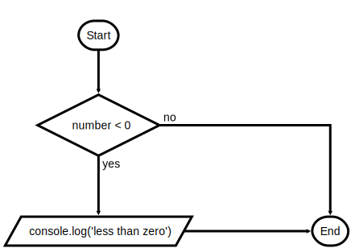
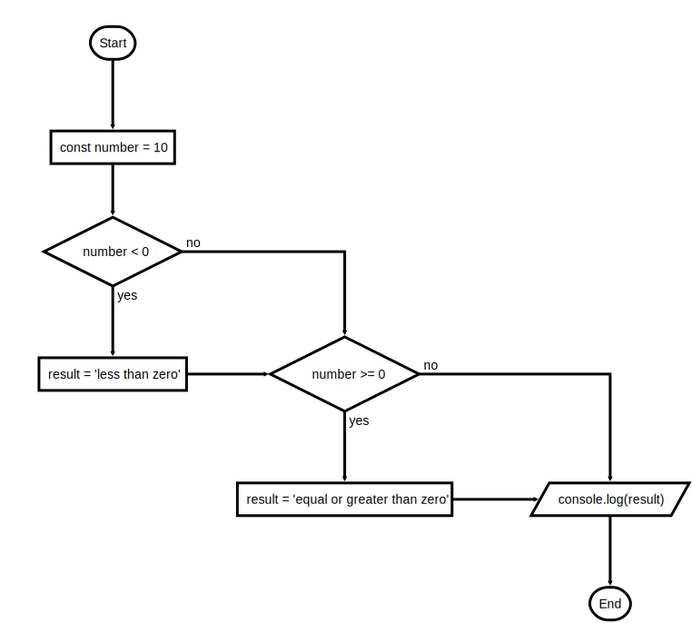
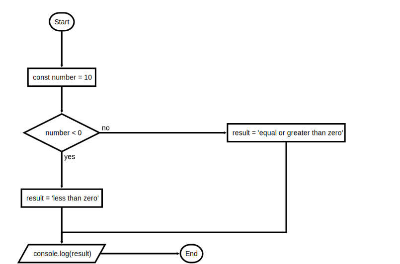
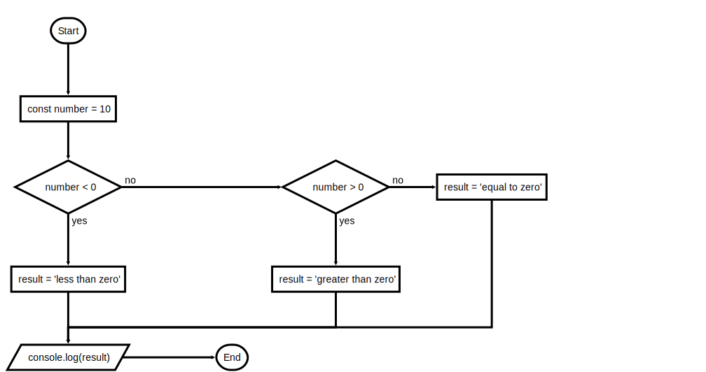
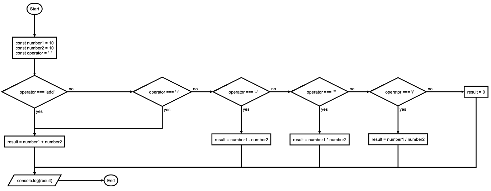
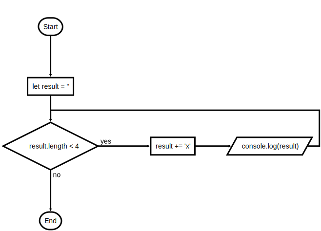
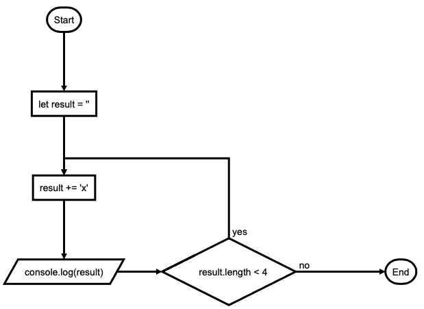
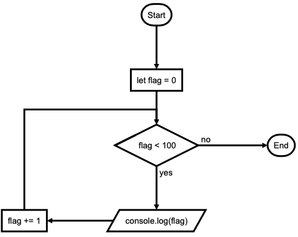
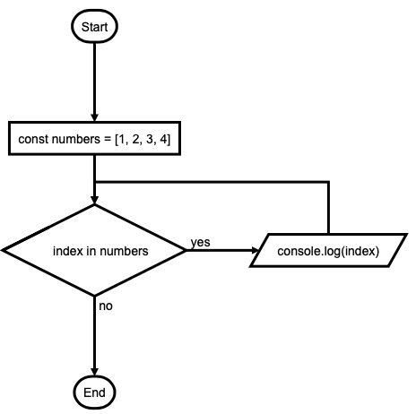
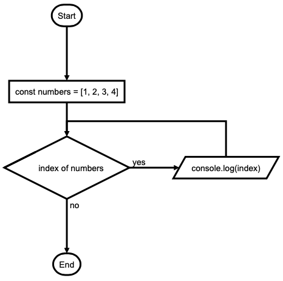

# Statements and Declarations

- [Control flow](#control-flow)
  - [`if...else`](#ifelse)
  - [`switch`](#switch)
- [Iterations](#iterations)
  - [`while`](#while)
  - [`do...while`](#dowhile)
  - [`for`](#for)
  - [`for...in`](#forin)
  - [`for...of`](#forof) ([Array.prototype.entries()](#forof-arrayprototypeentries), [Object.keys()](#forof-objectkeys), [Object.values()](#forof-objectvalues), [Object.entries()](#forof-objectentries))

## Control flow

---

### if...else



if does not executes: false, 0, "", null, undefined, NaN:

```js
const number = 10;

if (number < 0) console.log('less than zero'); //=> greater than zero
```

```js
const number = 10;

if (number < 0) {
  console.log('less than zero'); //=> greater than zero
}
```



```js
const number = 10;
let result;

if (number < 0) {
  result = 'less than zero';
}
if (number >= 0)
  result = 'equal or greater than zero';
}

console.log(result); //=> equal or greater than zero
```



```js
let number = 10;
let result;

if (number < 0) {
  result = 'less than zero';
} else {
  result = 'equal or greater than zero';
}

console.log(result); //=> equal or greater than zero
```



```js
const number = 10;
let result;

if (number < 0) {
  result = 'less than zero';
} else if (number > 0) {
  result = 'greater than zero';
} else {
  result = 'equal to zero';
}

console.log(result); //=> greater than zero
```

### switch



```js
const number1 = 10;
const number2 = 10;
const operator = '+'; // (+, -, *, /)
let result;

// strict comparison
switch (operator) {
  case 'add':
  case '+':
    result = number1 + number2;
    break;
  case '-':
    result = number1 - number2;
    break;
  case '*':
    result = number1 * number2;
    break;
  case '/':
    result = number1 / number2;
    break;
  default:
    result = 0;
}

console.log(result); //=> 20
```

## Iterations

---

### while



```js
let result = '';

while (result.length < 4) {
  result += 'x';
  console.log(result);
}
//=>
// x
// xx
// xxx
// xxxx
```

### do...while



```js
let result = '';

do {
  result += 'x';
  console.log(result);
} while (result.length < 4);
//=>
// x
// xx
// xxx
// xxxx
```

### for



```js
for (let flag = 0; flag < 100; flag += 1) {
  console.log(flag);
}
//=>
// 0
// 1
// 2
// ...
// 97
// 98
// 99
```

```js
let result = '';

for (let flag = 0; flag < 100; flag++) {
  result += flag < 10 ? '0' + flag : flag;
  result += flag % 10 === 9 ? '\n' : ' ';
}

console.log(result);
//=>
// 00 01 02 03 04 05 06 07 08 09
// 10 11 12 13 14 15 16 17 18 19
// 20 21 22 23 24 25 26 27 28 29
// 30 31 32 33 34 35 36 37 38 39
// 40 41 42 43 44 45 46 47 48 49
// 50 51 52 53 54 55 56 57 58 59
// 60 61 62 63 64 65 66 67 68 69
// 70 71 72 73 74 75 76 77 78 79
// 80 81 82 83 84 85 86 87 88 89
// 90 91 92 93 94 95 96 97 98 99
```

<!--
TODO
# # #
 # #
# #
 #

continue & break
-->

### for...in



Iterates over the enumerable properties of an object:

```js
const numbers = [1, 2, 3, 4];

for (const index in numbers) {
  console.log(index);
}
//=>
// 0
// 1
// 2
// 3
```

```js
const numbers = [1, 2, 3, 4];

numbers['number'] = 10;

for (let index in numbers) {
  console.log(`${index} -> ${numbers[index]}`);
}
//=>
// 0 -> 1
// 1 -> 2
// 2 -> 3
// 3 -> 4
// number -> 10
```

### for...of



Iterates over iterable objects (including arrays, array-like objects, iterators and generators):

```js
const numbers = [1, 2, 3, 4];

for (let number of numbers) {
  console.log(number);
}
//=>
// 1
// 2
// 3
// 4
```

#### for...of (Array.prototype.entries())

```js
const numbers = [1, 2, 3, 4];

numbers['number'] = 10;

for (let [index, number] of numbers.entries()) {
  console.log(`${index} => ${number}`);
}
//=>
// 0 => 1
// 1 => 2
// 2 => 3
// 3 => 4
```

#### for...of (Object.keys)

```js
const student = {
  id: 1,
  name: 'fulano',
  email: 'fulano@gmail.com',
};

for (let index of Object.keys(student)) {
  console.log(student[index]);
}
//=>
// 1
// fulano
// fulano@gmail.com
```

#### for...of (Object.values)

```js
const student = {
  id: 1,
  name: 'fulano',
  email: 'fulano@gmail.com',
};

for (let values of Object.values(student)) {
  console.log(values);
}
//=>
// 1
// fulano
// fulano@gmail.com
```

#### for...of (Object.entries)

```js
const student = {
  id: 1,
  name: 'fulano',
  email: 'fulano@gmail.com',
};

for (const [key, value] of Object.entries(student)) {
  console.log(`${key} -> ${value}`);
}
//=>
// id -> 1
// name -> fulano
// email -> fulano@gmail.com
```

## Recap

---

| Category              | Statements                                                                           |
| --------------------- | ------------------------------------------------------------------------------------ |
| Control flow          | `block`, `break`, `continue`, `empty`, `if...esle`, `switch`, `throw`, `try...catch` |
| Iterations            | `do...while`, `for`, `for...in`, `for...of`, `while`, `do...while`                   |
| Others                | `debugger`, `export`, `import`, `label`                                              |
| Declarations          | `var`, `let`, `const`                                                                |
| Functions and classes | `function`, `function*`, `return`, `class`                                           |
