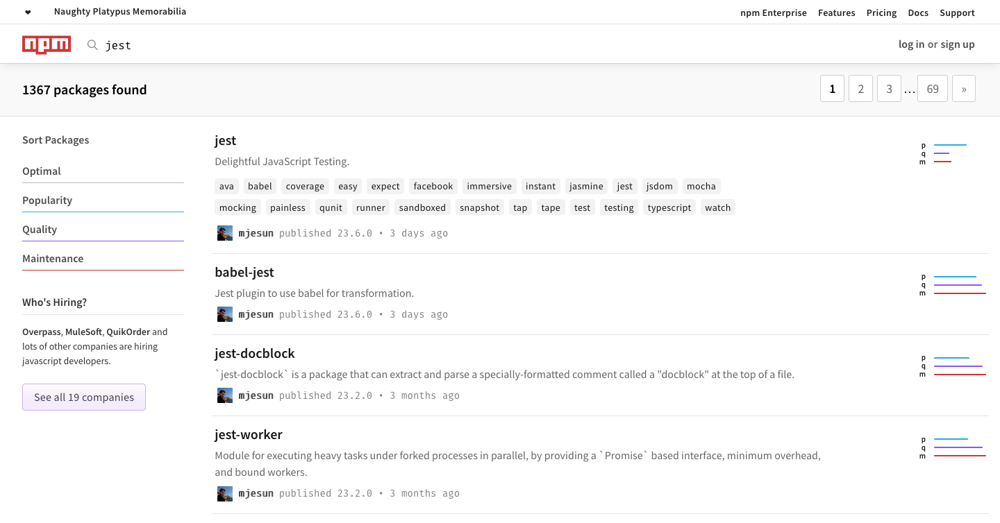

# Node Package Manager (NPM)

* [Architecture](#architecture)
* [Website](#website)
* [Registry](#registry)
* [CLI](#cli)

## Architecture

### Package Managers

* [https://libraries.io/](https://libraries.io/)
  * [NPM (Javascript)](https://www.npmjs.com/)
  * [PyPI (Python)](https://pypi.org/)
  * [Packagist (PHP)](https://packagist.org/)

### Components

```
┌────────────┐  ┌────────────┐  ┌─────────┐
│  Website   │  │  Registry  │  │   CLI   │
└────────────┘  └────────────┘  └─────────┘
```

## Website

[https://www.npmjs.com/search?q=jest](https://www.npmjs.com/search?q=jest):


## Registry

### NPM Public Registry

```
    Packages                              Projects
                                      ┌─────────────────┐
                                      │ Project A       │
┌───────────────┐                     │┌───────────────┐│
│reuseble-code-x├─┐               ┌──▶││reuseble-code-x││
└───────────────┘ │   ╭────────╮  │   │└───────────────┘│
┌───────────────┐ │   │ Public │  │   └─────────────────┘
│reuseble-code-y├─┼──▶│Registry├──┤   ┌─────────────────┐
└───────────────┘ │   │ (NPM)  │  │   │ Project B       │ 
┌───────────────┐ │   ╰────────╯  │   │┌───────────────┐│
│reuseble-code-z├─┘               ├──▶││reuseble-code-y││
└───────────────┘                 │   │└───────────────┘│
                                  │   │┌───────────────┐│
                                  └──▶││reuseble-code-z││
                                      │└───────────────┘│
                                      └─────────────────┘
```

### Create a Package

```
 reuseble-code 
┌─────────────┐
│lib.js       │
│package.json │
└─────────────┘
```

```js
{
  "name": "reuseble-code",
  "version": "1.0.0"
}
```

## CLI

### Generate a plain old package.json

```
$ npm init -y
```

```js
{
  "name": "reuseble-code",
  "version": "1.0.0",
  "description": "",
  "main": "index.js",
  "scripts": {
    "test": "echo \"Error: no test specified\" && exit 1"
  },
  "keywords": [],
  "author": "",
  "license": "ISC"
}
```

### Publish/Install Package

```
                                                   ┌───────────────────────────┐    
                                ╭────────╮    ┌───▶│$ npm install reuseble-code│
┌───────────────────────────┐   │ Public │    │    └───────────────────────────┘
│$ npm publish reuseble-code├──▶│Registry├────┤       
└───────────────────────────┘   │ (NPM)  │    │    ┌───────────────────────────┐
                                ╰────────╯    └───▶│$ npm install reuseble-code│
                                                   └───────────────────────────┘ 
```

### Specifying Dependencies

[date-fns](https://date-fns.org):
```
$ cd project
$ npm i date-fns
```

```js
{
  "name": "project",
  "version": "1.0.0",
  "dependencies": {
    "date-fns": "^1.29.0"
  }
}
```

```
$ ls node_modules
```

```
$ rm -rf node_modues
$ npm install
```

### Specifying devDependencies

[Jest](https://jestjs.io/en):
```
$ cd project
$ npm i -D jest
```

```js
{
  "name": "project",
  "version": "1.0.0",
  "devDependencies": {
    "jest": "^23.6.0"
  }
}
```

```
$ npx jest --version
```

### Specifying multiples devDependencies

[Jest using babel (ESM)](https://jestjs.io/docs/en/getting-started#using-babel):
```
$ cd project
$ npm i -D jest babel-jest babel-core regenerator-runtime babel-preset-env
```

**.babelrc**
```js
{
  "presets": ["env"]
}
```

**lib/sum.js**:
```js
function sum(a, b) {
  return a + b
}

export { sum }
```

**lib/sum.test.js**:
```js
import { sum } from './sum.js'

describe('Number Tools', () => {

  test('adding 1 + 2', () => {
    expect(sum(1, 2)).toBe(3)
  })

  test('adding 3 + 2', () => {
    expect(sum(3, 2)).toBe(5)
  })

})
```

```
$ tree . -I node_modules
.
├── lib
│   ├── sum.js
│   ├── sum.print.mjs
│   └── sum.test.js
├── package-lock.json
└── package.json

1 directory, 5 files
```

```
$ npx jest
 PASS  lib/sum.test.js
  Number Tools
    ✓ adding 1 + 2 (5ms)
    ✓ adding 3 + 2 (1ms)

Test Suites: 1 passed, 1 total
Tests:       2 passed, 2 total
Snapshots:   0 total
Time:        1.55s
Ran all test suites.
```