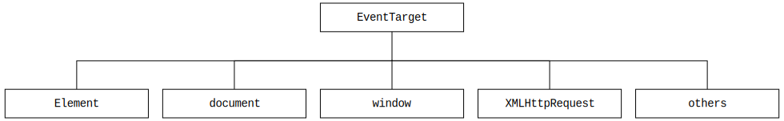

# [EventTarget](https://developer.mozilla.org/en-US/docs/Web/API/EventTarget)

* [Hierarchy](#hierarchy)
* [EventTarget.addEventListener()](#eventtargetaddeventlistener)
* [EventTarget.removeEventListener()](#eventtargetremoveeventlistener)

## Hierarchy
---



## [EventTarget.addEventListener()](https://developer.mozilla.org/en-US/docs/Web/API/EventTarget/addEventListener)
---

### Syntax

> target.addEventListener(type, listener[, options])<br>
> target.addEventListener(type, listener[, useCapture])<br>

### Example

Click ([MouseEvent](https://developer.mozilla.org/en-US/docs/Web/API/MouseEvent)):
```js
const button = document.querySelector('button#print')

button.addEventListener('click', function() {
  window.print()
})
```

Keyup ([KeyboardEvent](https://developer.mozilla.org/en-US/docs/Web/API/KeyboardEvent), [Key Values](https://developer.mozilla.org/en-US/docs/Web/API/KeyboardEvent/key/Key_Values)):
```js
const input = document.querySelector('input')

button.addEventListener('keyup', function(event) {
  if (event.key == 'Enter') {
    console.log('Enter key')
  }
})
```

## [EventTarget.removeEventListener()](https://developer.mozilla.org/en-US/docs/Web/API/EventTarget/removeEventListener)
---

### Syntax

> target.removeEventListener(type, listener[, options])<br>
> target.removeEventListener(type, listener[, useCapture])<br>

### Example

```js
const element = document.querySelector('button')

const handleMouseDown = function(){}

element.addEventListener("mousedown", handleMouseDown);
element.removeEventListener("mousedown", handleMouseDown);
```