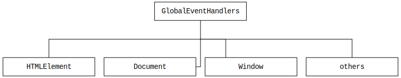

# [GlobalEventHandlers](https://developer.mozilla.org/en-US/docs/Web/API/GlobalEventHandlers)

## Hierarchy
---



## Registering on-event handlers
---

HTML attribute named on{eventtype}:
```html
<!DOCTYPE html>
<html lang="en">
<head>
  <meta charset="UTF-8">
  <meta name="viewport" content="width=device-width, initial-scale=1.0">
  <meta http-equiv="X-UA-Compatible" content="ie=edge">
  <title>Document</title>
</head>
<body>
  <h1>Lorem ipsum</h1>
  <button onclick="window.print()">Print</button>
</body>
</html>
```

Setting the on-event handlers property from JavaScript:
```html
<!DOCTYPE html>
<html lang="en">
<head>
  <meta charset="UTF-8">
  <meta name="viewport" content="width=device-width, initial-scale=1.0">
  <meta http-equiv="X-UA-Compatible" content="ie=edge">
  <title>Document</title>
</head>
<body>
  <h1>Lorem ipsum</h1>
  <button>Print</button>
</body>
</html>
```

```js
const button = document.querySelector('button')
button.onclick = function() {
  window.print()
}
```
