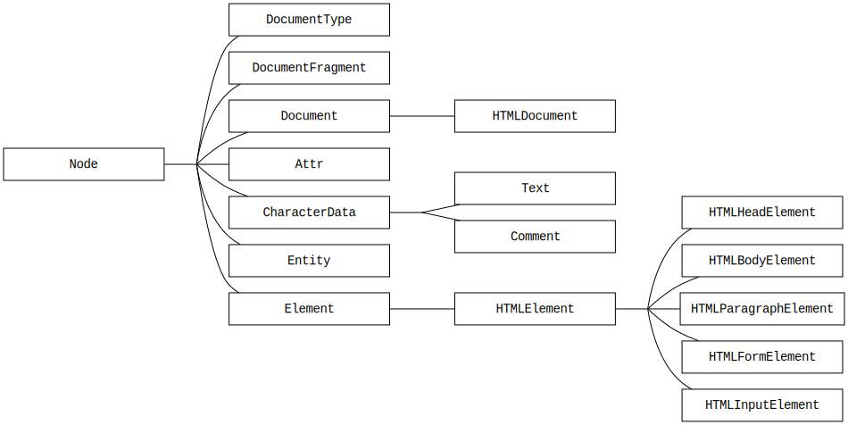
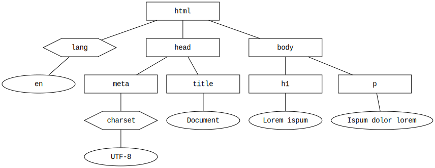

# [Node](https://developer.mozilla.org/en-US/docs/Web/API/Node)

* [Node Hierarchy](#node-hierarchy)
* [DOM Tree](#dom-tree)
* [Node.childNodes](nodechildNodes)
* [Node.firstChild](nodefirstchild)
* [Node.lastChild](nodelastchild)
* [Node.parentNode](nodeparentNode)

## Node Hierarchy
---



## DOM Tree
---

### Processing


### Example

```html
<!DOCTYPE html>
<html lang="en">
<head>
  <meta charset="UTF-8">
  <title>Document</title>
</head>
<body>
  <h1>Lorem ispum</h1>
  <p>Ipsum dolor lorem</p>
</body>
</html>
```

Output:



## [Node.childNodes]()
---

```js
const tbody = document.querySelector('table tbody')
const rows = tbody.childNodes

for (var i = 0; i < rows.length; i++) {
  rows[i]
}
```

## [Node.firstChild]()
---

```js
const tbody = document.querySelector('table tbody')
tbody.firstChild
```

## [Node.lastChild]()
---

```js
const tbody = document.querySelector('table tbody')
tbody.lastChild
```

## [Node.parentNode]()
---

```js
const tbody = document.querySelector('table tbody')
tbody.parentNode
```
