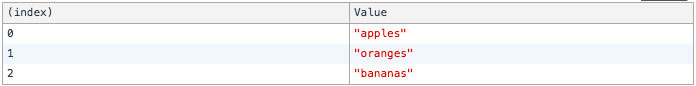
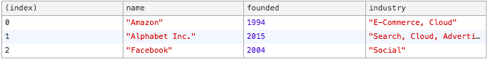
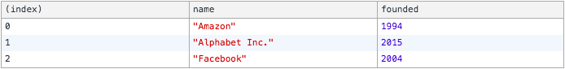

# [Console](https://developer.mozilla.org/en-US/docs/Web/API/Console)

* [Console.clear()](#consoleclear)
* [Console.log()](#consolelog)
* [Console.table()](#consoletable)
* [Console.time() 7 Console.timeEnd()](#consoletime--consoletimeend)

## [Console.clear()](https://developer.mozilla.org/en-US/docs/Web/API/Console/clear)
---

```js
console.clear()
```

## [Console.log()](https://developer.mozilla.org/en-US/docs/Web/API/Console/log)
---

```js
const name = 'Alice'
console.log(name)
```

```
Alice
> undefined
```

## [Console.table()](https://developer.mozilla.org/en-US/docs/Web/API/Console/table)
---

### Collections of primitive types

```js
const fruits = ["apples", "oranges", "bananas"]
console.table(fruits)
```



### Collections of compound types

```js
const companies = [
  {
    name: 'Amazon',
    founded: 1994,
    industry: 'E-Commerce, Cloud'
  },
  {
    name: 'Alphabet Inc.',
    founded: 2015,
    industry: 'Search, Cloud, Advertising'
  },
  {
    name: 'Facebook',
    founded: 2004,
    industry: 'Social'
  }
]
console.table(companies)
```



### Restricting the columns displayed

```js
const companies = [
  {
    name: 'Amazon',
    founded: 1994,
    industry: 'E-Commerce, Cloud'
  },
  {
    name: 'Alphabet Inc.',
    founded: 2015,
    industry: 'Search, Cloud, Advertising'
  },
  {
    name: 'Facebook',
    founded: 2004,
    industry: 'Social'
  }
]
console.table(companies, ["name", "founded"])
```



### Sorting columns

## [Console.time()](https://developer.mozilla.org/en-US/docs/Web/API/Console/time) & [Console.timeEnd()](https://developer.mozilla.org/en-US/docs/Web/API/Console/timeEnd)
---

```js
const array = [1, 2, 3, 4, 5, 6, 7, 8, 9]

console.time('testFor')
for(let x = 0 ; x < array.length; x++) {
  array[x]
}
console.timeEnd('testFor')

console.time('testForOf')
for(let x of array) {
  x
}
console.timeEnd('testForOf')

console.time('testForEach')
array.forEach(x => x)
console.timeEnd('testForEach')
```

```
testFor: 0.04296875ms
testForOf: 0.108154296875ms
testForEach: 0.083984375ms
```

## References
---

* [Console API](https://console.spec.whatwg.org)