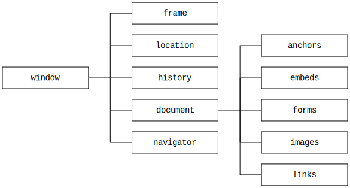
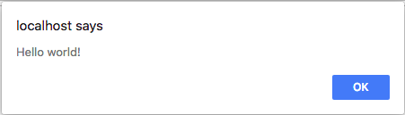
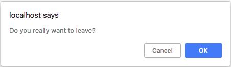
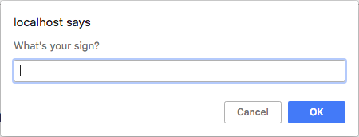

# [Window](https://developer.mozilla.org/en-US/docs/Web/API/Window)

* [Window Features](#windowfeatures)
* [Window Hierarchy](#windowhierarchy)
* [Window.innerHeight & Window.innerWidth](#windowinnerheight--windowinnerwidth)
* [Window.scrollY & Window.scrollX](#windowscrolly--windowscrollx)
* [Window.scroll()](#windowscroll)
* [Window.alert()](#windowalert)
* [Window.confirm()](#windowconfirm)
* [Window.prompt()](#windowprompt)
* [Window.close()](#windowclose)
* [Window.open()](#windowopen)
* [Window.print()](#windowprint)

## Window Features
---

<br>
Reference: [MDN](https://developer.mozilla.org/en-US/docs/Web/API/Window/open)

## Window Hierarchy
---



## [Window.innerHeight](https://developer.mozilla.org/en-US/docs/Web/API/Window/innerHeight) & [Window.innerWidth](https://developer.mozilla.org/en-US/docs/Web/API/Window/innerWidth)
---

```js
const width = window.innerWidth
const height = window.innerHeight
console.log(width, height)
```

## [Window.scrollY](https://developer.mozilla.org/en-US/docs/Web/API/Window/scrollY) & [Window.scrollX](https://developer.mozilla.org/en-US/docs/Web/API/Window/scrollX)
---

```js
const x = window.scrollX
const y = window.scrollY
console.log(x, y)
```

## [Window.scroll()](https://developer.mozilla.org/en-US/docs/Web/API/Window/scroll)
---


### Syntax

> window.scroll(x-coord, y-coord)<br>
> window.scroll(options) 

### Example

```js
window.scroll(0, 100)
```

```js
window.scroll({
  top: 1000,
  left: 50,
  behavior: "smooth"
})
```

## [Window.alert()](https://developer.mozilla.org/en-US/docs/Web/API/Window/alert)
---


### Syntax

> window.alert(message)

### Example

```js
window.alert("Hello world!")
```

Ouput:



## [Window.confirm()](https://developer.mozilla.org/en-US/docs/Web/API/Window/confirm)
---

### Syntax

> const result = window.confirm(message)

### Example

```js
const close = window.confirm("Do you really want to leave?")
console.log(close)
```

Ouput:



## [Window.prompt()](https://developer.mozilla.org/en-US/docs/Web/API/Window/prompt)
---

### Syntax

> const result = window.prompt(message)

### Example

```js
const sign = prompt("What's your sign?")
console.log(sign)
```

Ouput:



## [Window.close()](https://developer.mozilla.org/en-US/docs/Web/API/Window/close)
---

```js
window.close()
```

## [Window.open()](https://developer.mozilla.org/en-US/docs/Web/API/Window/open)
---

```js
const windowRef = window.open('http://www.ifpb.edu.br')
```

## [Window.print()](https://developer.mozilla.org/en-US/docs/Web/API/Window/print)
---

```js
window.print()
```